# Векторный потенциал прецессирующего магнитного диполя

Предыстория вопроса состоит в том, что в работе 

https://nbviewer.org/github/daju1/articles/blob/master/electrostatic_vector_potential/Vector_potential_of_the_electrostatic_field_of_a_point_charge.ipynb

мне удалось записать векторный потенциал для кулоновского поля точечного электрического заряда. Таким образом формула для векторного потенциала кулоновского заряда получена и проверка показала, что операция ротора примененная к этому векторнному потенциалу дает кулоновское электрическое поле точечного заряда.

Полученный векторный потенциал по своей форме весьма интересный. Его вид как будто показал, что существование электростатического заряда не возможно без выделенной оси вращения.

Поэтому в настоящей работе я задаюсь следующим вопросом: может ли векторный потенциал кулоновского поля электрона создаваться, например, с помощью прецессии дипольного момента магнетона Бора?

Таким образом я рассматриваю далее следующую задачу: имеется магнитный диполь с двумя противоположно заряженными магнитными полюсами, который прецессирует вокруг оси проходящей через центр магнитного диполя. Более наглядно моделируемая в данной работе структура нарисована здесь

https://nbviewer.org/github/daju1/articles/blob/master/electrostatic_vector_potential/Structure_of_electron.ipynb


Таким образом создаётся симметричная пара кольцевых магнитных токов, которые текут во взаимно противоположных направлениях (потому как движение по окружности в одном и том же направлении, например по часовой стрелке, пары магнитных зарядов, имеющих противоположные знаки создает пару взаимно противоположных по направлению кольцевых магнитных токов).

Для решения этой задачи в литературе был найден алгоритм расчета векторного потенциала для кольцевого тока, который сводится к эллиптическим интегралам. Таким образом трехмерное интегрирование сводится к двумерному.

Однако работа в цилиндрической системе координат для целей настоящей работы оказалась неудобной. Потому что в цилиндрических координатах интегральное уравнение Фредгольма первого рода не удалось привести к интегральному уравнению Фредгольма второго рода.

https://nbviewer.org/github/daju1/articles/blob/master/electrostatic_vector_potential/Vector_potential_of_a_precessing_magnetic_dipole.ipynb

Поэтому в данной работе решается задача расчёта векторного потенциала кольцевого тока в сферической системе координат с последующим решением интегрального уравнения Фредгольма.

Поскольку я рассматриваю не точечный магнитный заряд в составе прецессирующего диполя магнетона Бора, а распределенный в пространстве магнитный заряд, то в подынтегральном выражении моего интегрального уравнения есть два множителя: неизвестная функция плотности распределения магнитных токов в пространстве и так называемое ядро (или оператор) моего интегрального уравнения.

Интегральное уравнение решается методом итераций. Из-за вычислительных сложностей многоитерационного интегирования в данной работе представлен результат лишь нулевого приближения неизвестной функции распределения магнитных токов прецессирующего магнетона Бора в пространстве.


```python
from IPython.display import display, Math, Latex

def disp(ex):
    display(Math(latex(ex)))
    
def displ(tex):
    display(Math(tex))
```

если $\left( {{r}_{q}}<{{r}_{a}} \right)$ то

$A_{\varphi} = \frac{\mu \, I}{4 \pi}\,r_q \, sin \theta_q \,\frac{1}{{{r}_{a}}}\sum\limits_{l=0}^{\infty }{{{\left( \frac{{{r}_{q}}}{{{r}_{a}}} \right)}^{l}}{\frac{4\pi }{2l+1}\sum\limits_{m=-l}^{l}{Y_{l,m}^{*}\left( {{\theta }_{a}},{{\varphi }_{a}} \right)}\, \int\limits_{\varphi_q}^{} cos\,{\varphi_q } \, {{Y}_{l,m}}\left( {{\theta }_{q}},{{\varphi }_{q}} \right)}} \, d \varphi_q$

и если $\left( {{r}_{a}}<{{r}_{q}} \right)$ то

$A_{\varphi} = \frac{\mu \, I}{4 \pi}\,r_q \, sin \theta_q \, \frac{1}{{{r}_{q}}}\sum\limits_{l=0}^{\infty }{{{\left( \frac{{{r}_{a}}}{{{r}_{q}}} \right)}^{l}}{\frac{4\pi }{2l+1}\sum\limits_{m=-l}^{l}{Y_{l,m}^{*}\left( {{\theta }_{a}},{{\varphi }_{a}} \right)}\,\int\limits_{\varphi_q}^{} cos\,{\varphi_q } \, {{Y}_{l,m}}\left( {{\theta }_{q}},{{\varphi }_{q}} \right)}} \, d \varphi_q$

# Векторный потенциал электростатического поля точечного заряда

https://nbviewer.org/github/daju1/articles/blob/master/electrostatic_vector_potential/Vector_potential_of_the_electrostatic_field_of_a_point_charge.ipynb

в цилиндрической системе координат

$$\vec A = -\frac{ z}{{\rho}\sqrt{\rho^{2} + z^{2}} }\,{\vec {e}}_{\varphi }$$

в сферической системе координат

$$\vec A = -\frac{сtg \, \theta}{r}\,{\vec {e}}_{\varphi }$$


```python
A_q = lambda ra, theta_a : cot(theta_a) / (ra)
```

# Интегральное уравнение для векторного потенциала кулоновского заряда 

Итак, для ответа на вопрос может ли векторный потенциал кулоновского поля электрона создаваться, например, с помощью прецессии дипольного момента магнетона Бора? - рассмотрим следующую задачу.

Имеется магнитный диполь с двумя противоположно заряженными магнитными полюсами, который прецессирует вокруг оси проходящей через центр магнитного диполя. Таким образом создаётся симметричная пара кольцевых магнитных токов, которые текут во взаимно противоположных направлениях (потому как движение по окружности в одном и том же направлении, например по часовой стрелке, пары магнитных зарядов, имеющих противоположные знаки создает пару взаимно противоположных по направлению кольцевых магнитных токов).

Составим теперь интегральное уравнение в левой части которого запишем векторный потенциал кулоновского поля покоящегося электростатического заряда (найденный в предыдущей работе) а в правой части запишем векторный потенциал прецессирующего магнитного диполя на основе данных об объемном распределении магнитных токов.


в цилиндрической системе координат

$\rho_a$, $z_a$ - координаты наблюдения

$\rho_m$, $z_m$, $\varphi_m$ - координаты интегрирования, координаты магнитных зарядов

$-\frac{z_a}{{\rho_a}\sqrt{\rho_a^{2} + z_a^{2}} } = \int\limits_{z_m=-\infty}^{\infty}\,\,\int\limits_{\rho_m=0}^{\infty}\frac{j_m(\rho_m, z_m) \,\rho_m}{c} \left(\int\limits_{\varphi_m=0}^{2\pi}\frac{cos\,{\varphi_m } \, d \varphi_m}{R}\right)d \rho_m \, d z_m$

Неизвестные функции

$q_m(r_m, \theta_m)$ - плотность магнитного заряда в зависимости от цилиндрических координат

$\omega_m (r_m, \theta_m)$ - круговая частота вращения

$j_m(r_m, \theta_m) = q_m(r_m, \theta_m)\, \omega_m (r_m, \theta_m) \, r_m \, \sin \theta_m$ - плотность магнитного тока

<p>Если заданы сферические координаты точки, то переход к цилиндрическим осуществляется по формулам:
</p>

${\displaystyle {\begin{cases}\rho =r\sin \theta ,\\\varphi =\varphi ,\\z=r\cos \theta .\end{cases}}}$

<p>Обратно от цилиндрических к сферическим:
</p>

${\displaystyle {\begin{cases}r={\sqrt {\rho ^{2}+z^{2}}},\\\theta =\mathrm {arctg} {\dfrac {\rho }{z}},\\\varphi =\varphi .\end{cases}}}$

в сферической системе координат

$r_a$, $\theta_a$ - координаты наблюдения

$r_m$, $\theta_m$, $\varphi_m$ - координаты интегрирования, координаты магнитных зарядов

Итак, в исходном интегральном уравнении

$-\frac{сtg \, \theta_a}{r_a} = \int\limits_{\theta_m=0}^{\pi}\,\,\int\limits_{r_m=0}^{\infty}\frac{j_m(r_m, \theta_m) \,\sin \theta_m\, r_m^2}{c} \left(\int\limits_{\varphi_m=0}^{2\pi}\frac{cos\,{\varphi_m } }{\left| \overrightarrow{{{r}_{m}}}-\overrightarrow{{{r}_{a}}} \right|}\, d \varphi_m\right)d r_m \, d \theta_m$

в правой части уравнения второй интеграл по координате $r_m$ разбиваем на два интеграла от нуля до $r_a$ и от $r_a$ до бесконечности

$-\frac{сtg \, \theta_a}{r_a} = \int\limits_{\theta_m=0}^{\pi}\,\,\int\limits_{r_m=0}^{r_a}\frac{j_m(r_m, \theta_m) \,\sin \theta_m\, r_m^2}{c} \left(\int\limits_{\varphi_m=0}^{2\pi}\frac{cos\,{\varphi_m } }{\left| \overrightarrow{{{r}_{m}}}-\overrightarrow{{{r}_{a}}} \right|}\, d \varphi_m\right)d r_m \, d \theta_m + \int\limits_{\theta_m=0}^{\pi}\,\,\int\limits_{r_m=r_a}^{\infty}\frac{j_m(r_m, \theta_m) \,\sin \theta_m\, r_m^2}{c} \left(\int\limits_{\varphi_m=0}^{2\pi}\frac{cos\,{\varphi_m } }{\left| \overrightarrow{{{r}_{m}}}-\overrightarrow{{{r}_{a}}} \right|}\, d \varphi_m\right)d r_m \, d \theta_m$

Далее принимая во внимание, что

если $\left( {{r}_{m}}<{{r}_{a}} \right)$ то

$\frac{1}{\left| \overrightarrow{{{r}_{m}}}-\overrightarrow{{{r}_{a}}} \right|}=\frac{1}{{{r}_{a}}}\sum\limits_{l=0}^{\infty }{{{\left( \frac{{{r}_{m}}}{{{r}_{a}}} \right)}^{l}}{{P}_{l}} \cos \left( \gamma  \right)}$

и если $\left( {{r}_{a}}<{{r}_{m}} \right)$ то

$\frac{1}{\left| \overrightarrow{{{r}_{m}}}-\overrightarrow{{{r}_{a}}} \right|}=\frac{1}{{{r}_{q}}}\sum\limits_{l=0}^{\infty }{{{\left( \frac{{{r}_{a}}}{{{r}_{m}}} \right)}^{l}}{{P}_{l}} \cos \left( \gamma  \right)}$

делаем соотвествующие подстановки обратного расстояния между координатами заряда и точки наблюдения $\frac{1}{{R}}=\frac{1}{\left|\overrightarrow{r_{q}} - \overrightarrow{r_{a}}\right|}$

\begin{equation}
\begin{array}{c}
-\frac{сtg \, \theta_a}{r_a} = 
\int\limits_{\theta_m=0}^{\pi}\,\,\int\limits_{r_m=0}^{r_a}\frac{j_m(r_m, \theta_m) \,\sin \theta_m\, r_m^2}{c} \left(\int\limits_{\varphi_m=0}^{2\pi}\,\frac{cos\,{\varphi_m } }{{{r}_{a}}}\sum\limits_{l=0}^{\infty }{{\left( \frac{{{r}_{m}}}{{{r}_{a}}} \right)}^{l}}{{P}_{l}} \cos \left( \gamma  \right)\, d \varphi_m\right)d r_m \, d \theta_m \\ +
\int\limits_{\theta_m=0}^{\pi}\,\,\int\limits_{r_m=r_a}^{\infty}\frac{j_m(r_m, \theta_m) \,\sin \theta_m\, r_m^2}{c} \left(\int\limits_{\varphi_m=0}^{2\pi}\,\frac{cos\,{\varphi_m }}{{{r}_{m}}}\sum\limits_{l=0}^{\infty }{{\left( \frac{{{r}_{a}}}{{{r}_{m}}} \right)}^{l}}{{P}_{l}} \cos \left( \gamma  \right)\, d \varphi_m\right)d r_m \, d \theta_m
\end{array}
\end{equation}

Далее выносим операцию суммирования по $l$ отношения радиальных координат наблюдения и магнитных зарядов из внутреннего интеграла по $\varphi_m$

\begin{equation}
\begin{array}{c}
-\frac{сtg \, \theta_a}{r_a} = 
\int\limits_{r_m=0}^{r_a}\,\int\limits_{\theta_m=0}^{\pi}\,\frac{j_m(r_m, \theta_m) \,\sin \theta_m\, r_m^2}{c} \sum\limits_{l=0}^{\infty }{{\left( \frac{{{r}_{m}}}{{{r}_{a}}} \right)}^{l}}\left(\int\limits_{\varphi_m=0}^{2\pi}\,\frac{cos\,{\varphi_m } }{{{r}_{a}}}{{P}_{l}} \cos \left( \gamma  \right)\, d \varphi_m\right) \, d \theta_m \,d r_m  \\ +
\int\limits_{r_m=r_a}^{\infty}\,\int\limits_{\theta_m=0}^{\pi}\,\frac{j_m(r_m, \theta_m) \,\sin \theta_m\, r_m^2}{c} \sum\limits_{l=0}^{\infty }{{\left( \frac{{{r}_{a}}}{{{r}_{m}}} \right)}^{l}}\left(\int\limits_{\varphi_m=0}^{2\pi}\,\frac{cos\,{\varphi_m }}{{{r}_{m}}}{{P}_{l}} \cos \left( \gamma  \right)\, d \varphi_m\right) \, d \theta_m \,d r_m
\end{array}
\end{equation}

Теперь из под того же интеграла выносим радиальные координаты в знаменателе

\begin{equation}
\begin{array}{c}
-\frac{сtg \, \theta_a}{r_a} = 
\int\limits_{r_m=0}^{r_a}\,\int\limits_{\theta_m=0}^{\pi}\,\frac{j_m(r_m, \theta_m) \,\sin \theta_m\, r_m^2}{c\,r_a} \sum\limits_{l=0}^{\infty }{{\left( \frac{r_m}{r_a} \right)}^{l}}\left(\int\limits_{\varphi_m=0}^{2\pi}\,{cos\,{\varphi_m } }{P_l} \cos \left( \gamma  \right)\, d \varphi_m\right) \, d \theta_m \,d r_m \\ +
\int\limits_{r_m=r_a}^{\infty}\,\int\limits_{\theta_m=0}^{\pi}\,\frac{j_m(r_m, \theta_m) \,\sin \theta_m\, r_m^2}{c\,r_m} \sum\limits_{l=0}^{\infty }{{\left( \frac{r_a}{r_m} \right)}^{l}}\left(\int\limits_{\varphi_m=0}^{2\pi}\,{cos\,{\varphi_m }}{P_l} \cos \left( \gamma  \right)\, d \varphi_m\right) \, d \theta_m \,d r_m
\end{array}
\end{equation}

В данной формуле ${{P}_{l}} \cos \left( \gamma  \right)$ это полиномы Лежандра аргумент которых $\gamma$ есть угол между векторами ${{r}_{q}}$  и ${{r}_{a}}$. Применяя формулу, известную как теорему сложения

${{P}_{l}}\cos \left( \gamma  \right)=\frac{4\pi }{2l+1}\sum\limits_{m=-l}^{l}{Y_{l,m}^{*}\left( {{\theta }_{a}},{{\varphi }_{a}} \right)}\ {{Y}_{l,m}}\left( {{\theta}_{m}},{{\varphi }_{m}} \right)$

Обозначим

$S_{l}(\theta_m, \theta_a) = \left(\int\limits_{{\left(\varphi_m - \varphi_a\right)}=0}^{2\pi}\,{cos\,{{\left(\varphi_m - \varphi_a\right)} } }{P_l} \cos \left( \gamma  \right)\, d {\left(\varphi_m - \varphi_a\right)}\right)$

Обозначим

$S_{l}(\theta_m, \theta_a) = \left(\int\limits_{{\varphi_m}=0}^{2\pi}\,{cos\,{{\left(\varphi_m\right)} } }{P_l} \cos \left( \gamma  \right)\, d {\varphi_m}\right)$

$S_{l}(\theta_m, \theta_a) = \left(\int\limits_{{\varphi_m}=0}^{2\pi}\,{cos\,{{\left(\varphi_m\right)} } }\frac{4\pi }{2l+1}\sum\limits_{m=-l}^{l}{Y_{l,m}^{*}\left( {{\theta }_{a}},{{\varphi }_{a}} \right)}\ {{Y}_{l,m}}\left( {{\theta}_{m}},{{\varphi }_{m}} \right)\, d {\varphi_m}\right)$


```python
theta_m = var("theta_m")
theta_a = var("theta_a")
#assume (theta_a, "real")
r_m = var("r_m")
r_a = var("r_a")

assume(r_m>0)
assume(r_a>0)
```


```python
from sage.functions.special import spherical_harmonic
from sage.symbolic.integration.integral import definite_integral
from sage.calculus.calculus import symbolic_sum

l, m = var("l, m")
theta_m, phi_m = var ("theta_m, phi_m")
theta_a, phi_a = var ("theta_a, phi_a")
```


```python
def sympy_sum(expression, v, a, b):
    try:
        expression,v,a,b = [expr._sympy_() for expr in (expression, v, a, b)]
    except Exception as ex:
        #print("warning:", str(ex))
        pass
    from sympy import summation
    from sage.interfaces.sympy import sympy_init
    sympy_init()
    result = summation(expression, (v, a, b))
    
    try:
        return result._sage_()
    except AttributeError:
        #print(result)
        return result
        #raise AttributeError("Unable to convert SymPy result (={}) into"
        #        " Sage".format(result))
    except NotImplementedError as err:
        #print(result)
        return result
        #raise err
```

З.Флюгге Задачи по квантовой механике, том 2, стр. 299 формула (24)


```python
# S_l
def legendre_sum_A_ring_int_phi_q_hold(l, theta_m, theta_a, hold=True):
    from sage.functions.special import spherical_harmonic
    m = var("m")
    f = lambda l, m, theta_m, theta_a : \
        integrate(spherical_harmonic(l, m, theta_m, phi_m)*cos(phi_m), phi_m, 0, 2*pi, hold=hold) \
                  * conjugate(spherical_harmonic(l, m, theta_a, 0))
    return 4 * pi / (2*l + 1) * symbolic_sum(f(l, m, theta_m, theta_a), m, -l, l, hold=hold)

def legendre_sum_A_ring_hold(l, theta_m, theta_a, hold=True):
    return legendre_sum_A_ring_int_phi_q_hold(l, theta_m, theta_a, hold=hold)
```


```python
disp(legendre_sum_A_ring_int_phi_q_hold(l, theta_m, theta_a))
```


$\displaystyle \frac{4 \, \pi {\sum_{m=-l}^{l} \overline{Y_{l}^{m}\left(\theta_{a}, 0\right)} \int_{0}^{2 \, \pi} \cos\left(\phi_{m}\right) Y_{l}^{m}\left(\theta_{m}, \phi_{m}\right)\,{d \phi_{m}}}}{2 \, l + 1}$


$S_{l}(\theta_m, \theta_a) = \left(\int\limits_{{\varphi_m}=0}^{2\pi}\,{cos\,{{\left(\varphi_m\right)} } }\frac{4\pi }{2l+1}\sum\limits_{m=-l}^{l}{Y_{l,m}^{*}\left( {{\theta }_{a}},{{\varphi }_{a}} \right)}\ {{Y}_{l,m}}\left( {{\theta}_{m}},{{\varphi }_{m}} \right)\, d {\varphi_m}\right)$


```python
cY_lm = integrate(spherical_harmonic(l, m, theta_m, phi_m)*cos(phi_m), phi_m, 0, 2*pi, hold=True)
disp(cY_lm)
```


$\displaystyle \int_{0}^{2 \, \pi} \cos\left(\phi_{m}\right) Y_{l}^{m}\left(\theta_{m}, \phi_{m}\right)\,{d \phi_{m}}$


$S_{l}(\theta_m, \theta_a) = \frac{4\pi }{2l+1}\sum\limits_{m=-l}^{l}{Y_{l,m}^{*}\left( {{\theta }_{a}},{{\varphi }_{a}} \right)}\ {{cY}_{l,m}}\left( {{\theta}_{m}}\right)$


```python
cY_lm = integrate(spherical_harmonic(l, m, theta_m, phi_m)*cos(phi_m), phi_m, 0, 2*pi, algorithm="sympy")
disp(cY_lm)
```


$\displaystyle \begin{cases}{-\pi Y_{l}^{1}\left(\theta_{m}, 2 \, \pi\right) + \frac{1}{2} i \, Y_{l}^{1}\left(\theta_{m}, 0\right) - \frac{1}{2} i \, Y_{l}^{1}\left(\theta_{m}, 2 \, \pi\right)} & {m = \left(-1\right)}\\{\pi Y_{l}^{1}\left(\theta_{m}, 2 \, \pi\right) + \frac{1}{2} i \, Y_{l}^{1}\left(\theta_{m}, 0\right) - \frac{1}{2} i \, Y_{l}^{1}\left(\theta_{m}, 2 \, \pi\right)} & {m = 1}\\{\frac{i \, m Y_{l}^{m}\left(\theta_{m}, 0\right)}{m^{2} - 1} - \frac{i \, m Y_{l}^{m}\left(\theta_{m}, 2 \, \pi\right)}{m^{2} - 1}} & {1}\end{cases}$


```python
# S_l
def legendre_sum_A_ring_sympy(l, theta_m, theta_a):
    from sage.functions.special import spherical_harmonic
    m = var("m")
    f = lambda l, m, theta_m, theta_a : \
        cases(((m == -1, -pi*spherical_harmonic(l, 1, theta_m, 2*pi)), \
               (m == 1, pi*spherical_harmonic(l, 1, theta_m, 2*pi)), \
               (1, I*m*spherical_harmonic(l, m, theta_m, 0)/(m^2 - 1) \
                 - I*m*spherical_harmonic(l, m, theta_m, 2*pi)/(m^2 - 1)))) \
                  * conjugate(spherical_harmonic(l, m, theta_a, 0))

    return 4 * pi / (2*l + 1) * sympy_sum(f(l, m, theta_m, theta_a), m, -l, l)
```

теперь интегральное уравнение выглядит

\begin{equation}
\begin{array}{c}
-\frac{сtg \, \theta_a}{r_a} = 
\int\limits_{r_m=0}^{r_a}\,\int\limits_{\theta_m=0}^{\pi}\,\frac{j_m(r_m, \theta_m) \,\sin \theta_m\, r_m^2}{c\,r_a} \sum\limits_{l=0}^{\infty }{{\left( \frac{r_m}{r_a} \right)}^{l}}S_{l}(\theta_m, \theta_a) \, d \theta_m \,d r_m \\ +
\int\limits_{r_m=r_a}^{\infty}\,\int\limits_{\theta_m=0}^{\pi}\,\frac{j_m(r_m, \theta_m) \,\sin \theta_m\, r_m^2}{c\,r_m} \sum\limits_{l=0}^{\infty }{{\left( \frac{r_a}{r_m} \right)}^{l}}S_{l}(\theta_m, \theta_a) \, d \theta_m \,d r_m
\end{array}
\end{equation}

\begin{equation}
\begin{array}{c}
-\frac{сtg \, \theta_a}{r_a} = 
\int\limits_{r_m=0}^{r_a}\,\int\limits_{\theta_m=0}^{\pi}\,\frac{j_m(r_m, \theta_m)}{c}\,\left(\frac{\sin \theta_m\, r_m^2}{r_a} \sum\limits_{l=0}^{\infty }{{\left( \frac{r_m}{r_a} \right)}^{l}}S_{l}(\theta_m, \theta_a) \right)\, d \theta_m \,d r_m \\ +
\int\limits_{r_m=r_a}^{\infty}\,\int\limits_{\theta_m=0}^{\pi}\,\frac{j_m(r_m, \theta_m)}{c} \,\left({\sin \theta_m\, r_m} \sum\limits_{l=0}^{\infty }{{\left( \frac{r_a}{r_m} \right)}^{l}}S_{l}(\theta_m, \theta_a) \right) \, d \theta_m \,d r_m
\end{array}
\end{equation}

ядро интегрального уравнения (в круглых скобках)

Это линейное интегральное уравнение Фредгольма первого рода.

Продифференцируем обе части интегрального уравнения по $r_a$.

Поскольку переменная дифференцирования одновременно используется как верхний и нижний предел интегрирования, то в соответствии с правилом дифференцирования определённых интегралов в правой части число слагаемых увеличивается 

\begin{equation}
\begin{array}{c}
\frac{сtg \, \theta_a}{r_a^2} = 
\int\limits_{r_m=0}^{r_a}\,\int\limits_{\theta_m=0}^{\pi}\,\frac{j_m(r_m, \theta_m)}{c}\,\frac{d}{dr_a}\left(\frac{\sin \theta_m\, r_m^2}{r_a} \sum\limits_{l=0}^{\infty }{{\left( \frac{r_m}{r_a} \right)}^{l}}S_{l}(\theta_m, \theta_a) \right)\, d \theta_m \,d r_m +
\int\limits_{r_m=r_a}^{\infty}\,\int\limits_{\theta_m=0}^{\pi}\,\frac{j_m(r_m, \theta_m)}{c} \,\frac{d}{dr_a}\left({\sin \theta_m\,r_m} \sum\limits_{l=0}^{\infty }{{\left( \frac{r_a}{r_m} \right)}^{l}}S_{l}(\theta_m, \theta_a) \right) \, d \theta_m \,d r_m \\
+ \int\limits_{\theta_m=0}^{\pi}\,\frac{j_m(r_a, \theta_m)}{c}\,\left(\frac{\sin \theta_m\, r_m^2}{r_a} \sum\limits_{l=0}^{\infty }{{\left( \frac{r_m}{r_a} \right)}^{l}}S_{l}(\theta_m, \theta_a) \right)_{r_m = r_a}\, d \theta_m -
\int\limits_{\theta_m=0}^{\pi}\,\frac{j_m(r_a, \theta_m)}{c} \,\left({\sin \theta_m\,r_m} \sum\limits_{l=0}^{\infty }{{\left( \frac{r_a}{r_m} \right)}^{l}}S_{l}(\theta_m, \theta_a) \right)_{r_m = r_a} \, d \theta_m
\end{array}
\end{equation}

Осуществляя теперь подстановку $r_m = r_a$ имеем

\begin{equation}
\begin{array}{c}
\frac{сtg \, \theta_a}{r_a^2} = 
\int\limits_{r_m=0}^{r_a}\,\int\limits_{\theta_m=0}^{\pi}\,\frac{j_m(r_m, \theta_m)}{c}\,\frac{d}{dr_a}\left(\frac{\sin \theta_m\, r_m^2}{r_a} \sum\limits_{l=0}^{\infty }{{\left( \frac{r_m}{r_a} \right)}^{l}}S_{l}(\theta_m, \theta_a) \right)\, d \theta_m \,d r_m \\
+ \int\limits_{r_m=r_a}^{\infty}\,\int\limits_{\theta_m=0}^{\pi}\,\frac{j_m(r_m, \theta_m)}{c} \,\frac{d}{dr_a}\left({\sin \theta_m\,r_m} \sum\limits_{l=0}^{\infty }{{\left( \frac{r_a}{r_m} \right)}^{l}}S_{l}(\theta_m, \theta_a) \right) \, d \theta_m \,d r_m \\
+ \int\limits_{\theta_m=0}^{\pi}\,\frac{j_m(r_a, \theta_m)}{c}\,\left({\sin \theta_m \, r_a} \sum\limits_{l=0}^{\infty} S_{l}\left(\theta_m, \theta_a\right) \right)\, d \theta_m -
\int\limits_{\theta_m=0}^{\pi}\,\frac{j_m(r_a, \theta_m)}{c} \,\left({\sin \theta_m \,r_a} \sum\limits_{l=0}^{\infty} S_{l}(\theta_m, \theta_a) \right) \, d \theta_m
\end{array}
\end{equation}

После указанной подстановки отношения радиальных координат наблюдения и магнитных зарядов стали равными единице и поэтому мы видим что два слагаемых в правой части взаимно сокращаются

$\frac{сtg \, \theta_a}{r_a^2} = 
\int\limits_{r_m=0}^{r_a}\,\int\limits_{\theta_m=0}^{\pi}\,\frac{j_m(r_m, \theta_m)}{c}\,\frac{d}{dr_a}\left(\frac{\sin \theta_m\, r_m^2}{r_a} \sum\limits_{l=0}^{\infty }{{\left( \frac{r_m}{r_a} \right)}^{l}}S_{l}(\theta_m, \theta_a) \right)\, d \theta_m \,d r_m +
\int\limits_{r_m=r_a}^{\infty}\,\int\limits_{\theta_m=0}^{\pi}\,\frac{j_m(r_m, \theta_m)}{c} \,\frac{d}{dr_a}\left({\sin \theta_m\,r_m} \sum\limits_{l=0}^{\infty }{{\left( \frac{r_a}{r_m} \right)}^{l}}S_{l}(\theta_m, \theta_a) \right) \, d \theta_m \,d r_m$

теперь собственно производим дифференцирование в подынтегральных выражениях

\begin{equation}
\begin{array}{c}
\frac{сtg \, \theta_a}{r_a^2} = 
\int\limits_{r_m=0}^{r_a}\,\int\limits_{\theta_m=0}^{\pi}\,\frac{j_m(r_m, \theta_m)}{c}\,\left(\frac{\sin \theta_m\, r_m^2}{r_a} \sum\limits_{l=0}^{\infty }-l{{\left( \frac{{r_m}^{l}}{{r_a}^{l+1}} \right)}}S_{l}(\theta_m, \theta_a) - \frac{\sin \theta_m\, r_m^2}{r_a^2} \sum\limits_{l=0}^{\infty }{{\left( \frac{r_m}{r_a} \right)}^{l}}S_{l}(\theta_m, \theta_a)\right)\, d \theta_m \,d r_m  \\
+\int\limits_{r_m=r_a}^{\infty}\,\int\limits_{\theta_m=0}^{\pi}\,\frac{j_m(r_m, \theta_m)}{c} \,\left({\sin \theta_m\,r_m} \sum\limits_{l=0}^{\infty }l{{\left( \frac{{r_a}^{l-1}}{{r_m}^{l}} \right)}}S_{l}(\theta_m, \theta_a) \right) \, d \theta_m \,d r_m
\end{array}
\end{equation}


```python

```

\begin{equation}
\begin{array}{c}
\frac{сtg \, \theta_a}{r_a^2} = 
-\int\limits_{r_m=0}^{r_a}\,\int\limits_{\theta_m=0}^{\pi}\,\frac{j_m(r_m, \theta_m)}{c}\,\left(\frac{\sin \theta_m\, r_m^2}{r_a} \sum\limits_{l=0}^{\infty }l{{\left( \frac{{r_m}^{l}}{{r_a}^{l+1}} \right)}}S_{l}(\theta_m, \theta_a) + \frac{\sin \theta_m\, r_m^2}{r_a^2} \sum\limits_{l=0}^{\infty }{{\left( \frac{r_m}{r_a} \right)}^{l}}S_{l}(\theta_m, \theta_a)\right)\, d \theta_m \,d r_m  \\
+\int\limits_{r_m=r_a}^{\infty}\,\int\limits_{\theta_m=0}^{\pi}\,\frac{j_m(r_m, \theta_m)}{c} \,\left({\sin \theta_m\,r_m} \sum\limits_{l=0}^{\infty }l{{\left( \frac{{r_a}^{l-1}}{{r_m}^{l}} \right)}}S_{l}(\theta_m, \theta_a) \right) \, d \theta_m \,d r_m
\end{array}
\end{equation}


```python

```

\begin{equation}
\begin{array}{c}
\frac{сtg \, \theta_a}{r_a^2} = 
-\int\limits_{r_m=0}^{r_a}\,\int\limits_{\theta_m=0}^{\pi}\,\frac{j_m(r_m, \theta_m)}{c}\,\left(\frac{\sin \theta_m\, r_m^2}{r_a^2} \sum\limits_{l=0}^{\infty }l{{\left( \frac{{r_m}}{{r_a}} \right)}^{l}}S_{l}(\theta_m, \theta_a) + \frac{\sin \theta_m\, r_m^2}{r_a^2} \sum\limits_{l=0}^{\infty }{{\left( \frac{r_m}{r_a} \right)}^{l}}S_{l}(\theta_m, \theta_a)\right)\, d \theta_m \,d r_m  \\
+\int\limits_{r_m=r_a}^{\infty}\,\int\limits_{\theta_m=0}^{\pi}\,\frac{j_m(r_m, \theta_m)}{c} \,\left({\sin \theta_m\,r_m} \sum\limits_{l=0}^{\infty }l{{\left( \frac{{r_a}^{l-1}}{{r_m}^{l}} \right)}}S_{l}(\theta_m, \theta_a) \right) \, d \theta_m \,d r_m
\end{array}
\end{equation}

\begin{equation}
\begin{array}{c}
\frac{сtg \, \theta_a}{r_a^2} = 
-\int\limits_{r_m=0}^{r_a}\,\int\limits_{\theta_m=0}^{\pi}\,\frac{j_m(r_m, \theta_m)}{c}\,\left(\frac{\sin \theta_m\, r_m^2}{r_a^2} \sum\limits_{l=0}^{\infty }\left(l+1\right){{\left( \frac{{r_m}}{{r_a}} \right)}^{l}}S_{l}(\theta_m, \theta_a) \right)\, d \theta_m \,d r_m  \\
+\int\limits_{r_m=r_a}^{\infty}\,\int\limits_{\theta_m=0}^{\pi}\,\frac{j_m(r_m, \theta_m)}{c} \,\left(\frac{\sin \theta_m\,r_m}{r_a} \sum\limits_{l=0}^{\infty }l{{\left( \frac{{r_a}}{{r_m}} \right)}^{l}}S_{l}(\theta_m, \theta_a) \right) \, d \theta_m \,d r_m
\end{array}
\end{equation}

Ещё раз дифференцируем обе части интегрального уравнения по $r_a$

\begin{equation}
\begin{array}{c}
-\,2\,\frac{сtg \, \theta_a}{r_a^3} = 
-\int\limits_{r_m=0}^{r_a}\,\int\limits_{\theta_m=0}^{\pi}\,\frac{j_m(r_m, \theta_m)}{c}\,\frac{d}{dr_a}\left(\frac{\sin \theta_m\, r_m^2}{r_a^2} \sum\limits_{l=0}^{\infty }\left(l+1\right){{\left( \frac{{r_m}}{{r_a}} \right)}^{l}}S_{l}(\theta_m, \theta_a) \right)\, d \theta_m \,d r_m  \\
+\int\limits_{r_m=r_a}^{\infty}\,\int\limits_{\theta_m=0}^{\pi}\,\frac{j_m(r_m, \theta_m)}{c} \,\frac{d}{dr_a}\left(\frac{\sin \theta_m\,r_m}{r_a} \sum\limits_{l=0}^{\infty }l{{\left( \frac{{r_a}}{{r_m}} \right)}^{l}}S_{l}(\theta_m, \theta_a) \right) \, d \theta_m \,d r_m \\
-\int\limits_{\theta_m=0}^{\pi}\,\frac{j_m(r_a, \theta_m)}{c}\,\left(\frac{\sin \theta_m\, r_m^2}{r_a^2} \sum\limits_{l=0}^{\infty }\left(l+1\right){{\left( \frac{{r_m}}{{r_a}} \right)}^{l}}S_{l}(\theta_m, \theta_a) \right)_{r_m = r_a}\, d \theta_m  \\
-\int\limits_{\theta_m=0}^{\pi}\,\frac{j_m(r_a, \theta_m)}{c} \,\left(\frac{\sin \theta_m\,r_m}{r_a} \sum\limits_{l=0}^{\infty }l{{\left( \frac{{r_a}}{{r_m}} \right)}^{l}}S_{l}(\theta_m, \theta_a) \right)_{r_m = r_a} \, d \theta_m
\end{array}
\end{equation}

\begin{equation}
\begin{array}{c}
-\,2\,\frac{сtg \, \theta_a}{r_a^3} = 
-\int\limits_{r_m=0}^{r_a}\,\int\limits_{\theta_m=0}^{\pi}\,\frac{j_m(r_m, \theta_m)}{c}\,\frac{d}{dr_a}\left(\frac{\sin \theta_m\, r_m^2}{r_a^2} \sum\limits_{l=0}^{\infty }\left(l+1\right){{\left( \frac{{r_m}}{{r_a}} \right)}^{l}}S_{l}(\theta_m, \theta_a) \right)\, d \theta_m \,d r_m  \\
+\int\limits_{r_m=r_a}^{\infty}\,\int\limits_{\theta_m=0}^{\pi}\,\frac{j_m(r_m, \theta_m)}{c} \,\frac{d}{dr_a}\left(\frac{\sin \theta_m\, r_m}{r_a} \sum\limits_{l=0}^{\infty }l{{\left( \frac{{r_a}}{{r_m}} \right)}^{l}}S_{l}(\theta_m, \theta_a) \right) \, d \theta_m \,d r_m \\
-\int\limits_{\theta_m=0}^{\pi}\,\frac{j_m(r_a, \theta_m)}{c}\,\left({\sin \theta_m} \sum\limits_{l=0}^{\infty }\left(l+1\right)\,S_{l}(\theta_m, \theta_a) \right) \, d \theta_m  \\
-\int\limits_{\theta_m=0}^{\pi}\,\frac{j_m(r_a, \theta_m)}{c} \,\left({\sin \theta_m} \sum\limits_{l=0}^{\infty }l\,S_{l}(\theta_m, \theta_a) \right) \, d \theta_m
\end{array}
\end{equation}

\begin{equation}
\begin{array}{c}
-\,2\,\frac{сtg \, \theta_a}{r_a^3} = 
-\int\limits_{r_m=0}^{r_a}\,\int\limits_{\theta_m=0}^{\pi}\,\frac{j_m(r_m, \theta_m)}{c}\,\frac{d}{dr_a}\left(\frac{\sin \theta_m\, r_m^2}{r_a^2} \sum\limits_{l=0}^{\infty }\left(l+1\right){{\left( \frac{{r_m}}{{r_a}} \right)}^{l}}S_{l}(\theta_m, \theta_a) \right)\, d \theta_m \,d r_m  \\
+\int\limits_{r_m=r_a}^{\infty}\,\int\limits_{\theta_m=0}^{\pi}\,\frac{j_m(r_m, \theta_m)}{c} \,\frac{d}{dr_a}\left(\frac{\sin \theta_m\,r_m}{r_a} \sum\limits_{l=0}^{\infty }l{{\left( \frac{{r_a}}{{r_m}} \right)}^{l}}S_{l}(\theta_m, \theta_a) \right) \, d \theta_m \,d r_m \\
-\int\limits_{\theta_m=0}^{\pi}\,\frac{j_m(r_a, \theta_m)}{c}\,\left({\sin \theta_m} \sum\limits_{l=0}^{\infty }\left(2\,l+1\right)\,S_{l}(\theta_m, \theta_a) \right) \, d \theta_m
\end{array}
\end{equation}

\begin{equation}
\begin{array}{c}
-\,c\,\frac{2 \, ctg\left(\theta_{a}\right)}{r_{a}^{3}} = 
-\int\limits_{0}^{\pi} {j_{m}\left(r_{a}, \theta_{m}\right) \sin\left(\theta_{m}\right) {\sum\limits_{l=0}^{+\infty} {\left(2 \, l + 1\right)} S_{l}\left(l, \theta_{m}, \theta_{a}\right)}}\,{d \theta_{m}} \\
+ \frac{1}{r_{a}^{3}}\int\limits_{0}^{r_{a}} \int\limits_{0}^{\pi} {r_{m}^2 \,j_{m}\left(r_{m}, \theta_{m}\right) \sin\left(\theta_{m}\right) {\sum\limits_{l=0}^{+\infty} {{\left(l^{2} + 3 \, l + 2\right)} \left(\frac{r_{m}}{r_{a}}\right)^{l} S_{l}\left(l, \theta_{m}, \theta_{a}\right)}}}\,{d \theta_{m}}\,{d r_{m}} \\
+ \frac{1}{r_{a}^{2}}\int\limits_{r_{a}}^{+\infty} \int\limits_{0}^{\pi} {r_m \,j_{m}\left(r_{m}, \theta_{m}\right) \sin\left(\theta_{m}\right) {\sum\limits_{l=0}^{+\infty} {{\left(l^{2} - l\right)} \left(\frac{r_{a}}{r_{m}}\right)^{l} S_{l}\left(l, \theta_{m}, \theta_{a}\right)}{}}}\,{d \theta_{m}}\,{d r_{m}} 
\end{array}
\end{equation}

Таким образом, с помощью двукратного дифференцирования удалось вытащить неизвестную функцию из под двукратного интеграла в однократный. 

Интегральное уравнение можно упростить введя выражение ядер интегрирования

$K_1(\theta_m, \theta_a) = \sin\left(\theta_{m}\right) {\sum\limits_{l=0}^{+\infty} {\left(2 \, l + 1\right)} S_{l}\left(l, \theta_{m}, \theta_{a}\right)}$

$K_2(r_m, r_a, \theta_m, \theta_a) = \sin\left(\theta_{m}\right) {\sum\limits_{l=0}^{+\infty}{\left(l^{2} + 3 \, l + 2\right)} \left(\frac{r_m}{r_a}\right)^l} S_{l}\left(l, \theta_{m}, \theta_{a}\right)$

$K_3(r_m, r_a, \theta_m, \theta_a) = \sin\left(\theta_{m}\right) {\sum\limits_{l=0}^{+\infty} {\left(l^{2} - l\right)}\left(\frac{r_a}{r_m}\right)^l}S_{l}\left(l, \theta_{m}, \theta_{a}\right)$


Обозначим

\begin{equation}
\begin{array}{rl}
Q_{l}\left(\theta_m, \theta_a\right) = & \\
& sin\left(\theta_m\right)\,S_{l}\left(\theta_m, \theta_a\right) = \\
& 
\begin{array}{ll}
\,\,\,\,& sin\left(\theta_m\right)\,\left(\int\limits_{{\left(\varphi_m - \varphi_a\right)}=0}^{2\pi}\,{cos\,{{\left(\varphi_m - \varphi_a\right)} } }{P_l} \cos \left( \gamma  \right)\, d {\left(\varphi_m - \varphi_a\right)}\right)
\end{array}
\end{array}
\end{equation}


```python
def Kr2(l, r_m, r_a):
    return (r_m/r_a)^l
def Kr3(l, r_m, r_a):
    return (r_a/r_m)^l
```


```python
def Kl1(l):
    return (2*l + 1)
def Kl2(l):
    return (l^2 + 3*l + 2)
def Kl3(l):
    return (l^2 - l)
```


```python
K_1 = function("K_1")(theta_m, theta_a)
K_2 = function("K_2")(r_m, r_a, theta_m, theta_a)
K_3 = function("K_3")(r_m, r_a, theta_m, theta_a)
```

Таким образом краткая запись интегрального уравнения имеет вид

\begin{equation}
\begin{array}{c}
-\,c\,\frac{2 \, \cot\left(\theta_{a}\right)}{r_{a}^{3}} = 
-\,\int\limits_{0}^{\pi} j_{m}\left(r_{a}, \theta_{m}\right)
K_1(\theta_m, \theta_a)
\,{d \theta_{m}} \\
+ \frac{1}{r_a^3}\int\limits_{0}^{r_{a}} r_{m}^2 \int\limits_{0}^{\pi}
j_{m}\left(r_{m}, \theta_{m}\right)
K_2(r_m, r_a, \theta_m, \theta_a)
\,{d \theta_{m}}\,{d r_{m}} \\
+ \frac{1}{r_a^2}\int\limits_{r_{a}}^{+\infty} r_m \int\limits_{0}^{\pi}
j_{m}\left(r_{m}, \theta_{m}\right)
K_3(r_m, r_a, \theta_m, \theta_a)
\,{d \theta_{m}}\,{d r_{m}} 
\end{array}
\end{equation}

Теперь, поскольку ввиду симметричных свойств первого ядра интегрирования тем же самым приёмом вытащить неизвестную функцию из под полученного однократного интеграла не удаётся, можно попытаться разделить переменные в неизвестной функции

Неизвестные функции

$j_m(r_m, \theta_m) = j_r(r_m) \, j_{\theta}(\theta_m) = q_r(r_m) \, q_{\theta}(\theta_m)\, \omega_{r} (r_m)\, \omega_{\theta} (\theta_m) \, r_m \, \sin \theta_m$ - плотность магнитного тока

\begin{equation}
\begin{array}{c}
-\frac{2 \, \cot\left(\theta_{a}\right)}{r_{a}^{3}} = 
-\frac{j_r(r_a)}{c} \, \int\limits_{0}^{\pi} j_{\theta}(\theta_m)
K_1(\theta_m, \theta_a)
\,{d \theta_{m}} \\
+ \frac{1}{r_a^3}\int\limits_{0}^{r_{a}} r_m^2 \,\frac{j_r(r_m)}{c} \, \int\limits_{0}^{\pi}
j_{\theta}(\theta_m)
K_2(r_m, r_a, \theta_m, \theta_a)
\,{d \theta_{m}}\,{d r_{m}}
+ \frac{1}{r_a^2}\int\limits_{r_{a}}^{+\infty} r_m\,\frac{j_r(r_m)}{c} \, \int\limits_{0}^{\pi}
j_{\theta}(\theta_m)
K_3(r_m, r_a, \theta_m, \theta_a)
\,{d \theta_{m}}\,{d r_{m}} 
\end{array}
\end{equation}


```python

```

$$\begin{array}{c}
\frac{j_r(r_a)}{r} \, \int\limits_{0}^{\pi} j_{\theta}(\theta_m) K_1(\theta_m, \theta_a)
\,{d \theta_{m}} = \\
\frac{2 \, \cot\left(\theta_{a}\right)}{r_{a}^{3}}
+ \frac{1}{r_a^3}\int\limits_{0}^{r_{a}} r_m^2 \,\frac{j_r(r_m)}{r} \, \int\limits_{0}^{\pi}
j_{\theta}(\theta_m)
K_2(r_m, r_a, \theta_m, \theta_a)
\,{d \theta_{m}}\,{d r_{m}} \\
+ \frac{1}{r_a^2}\int\limits_{r_{a}}^{+\infty} r_m \, \frac{j_r(r_m)}{c} \, \int\limits_{0}^{\pi}
j_{\theta}(\theta_m)
K_3(r_m, r_a, \theta_m, \theta_a)
\,{d \theta_{m}}\,{d r_{m}} 
\end{array}$$

Введя обозначение

$$L\left(j_{\theta}, \theta_a\right)={\int\limits_{0}^{\pi} j_{\theta}(\theta_m) K_1(\theta_m, \theta_a)\,{d \theta_{m}}}$$

$$L\left(j_{\theta}, \theta_a\right)={\int\limits_{0}^{\pi} j_{\theta}(\theta_m) \sin\left(\theta_{m}\right) {\sum\limits_{l=0}^{+\infty} {\left(2 \, l + 1\right)} S_{l}\left(l, \theta_{m}, \theta_{a}\right)}\,{d \theta_{m}}}$$

$$L\left(j_{\theta}, \theta_a\right)={\sum\limits_{l=0}^{+\infty} {\left(2 \, l + 1\right)}\int\limits_{0}^{\pi} j_{\theta}(\theta_m) \sin\left(\theta_{m}\right) { S_{l}\left(l, \theta_{m}, \theta_{a}\right)}\,{d \theta_{m}}}$$

Введя также обозначение

$$M_l\left(j_{\theta}, \theta_a\right)={\int\limits_{0}^{\pi} j_{\theta}(\theta_m)\,S_l(\theta_m, \theta_a)\,sin\left(\theta_m\right)\,{d \theta_{m}}}$$

$$M_l\left(j_{\theta}, \theta_a\right)={\int\limits_{0}^{\pi} j_{\theta}(\theta_m)\,Q_l(\theta_m, \theta_a)\,{d \theta_{m}}}$$

$$m_l\left(j_{\theta}, \theta_a\right)= j_{\theta}(\theta_m)\,Q_l(\theta_m, \theta_a)$$


```python
def ml(l, j_theta, theta_a):
    # return j_theta(theta_m=theta_m) * Q_l(l, theta_m, theta_a)
    return j_theta(theta_m=theta_m) * sin(theta_m) * legendre_sum_A_ring_sympy(l, theta_m, theta_a)

def Ml(l, j_theta, theta_a):
    return integrate(ml(l=l, j_theta=j_theta, theta_a=theta_a), theta_m, 0, pi, hold=False)
```

$$L\left(j_{\theta}, \theta_a\right)={\sum\limits_{l=0}^{+\infty} {\left(2 \, l + 1\right)}M_l\left(j_{\theta}, \theta_a\right)}$$

Получаем интегральное уравнение, записанное в виде, пригодном для итерационной процедуры

\begin{equation}
\begin{array}{c}
\frac{j_r(r_a)}{c} = 
\frac{2 \, \cot\left(\theta_{a}\right)}{r_{a}^{3}}\,\frac{1}{L\left(j_{\theta}, \theta_a\right)}
+ \frac{1}{L\left(j_{\theta}, \theta_a\right)}\frac{1}{r_a^3}\int\limits_{0}^{r_{a}} r_m^2 \,\frac{j_r(r_m)}{c} \, \int\limits_{0}^{\pi}
j_{\theta}(\theta_m)
K_2(r_m, r_a, \theta_m, \theta_a)
\,{d \theta_{m}}\,{d r_{m}} \\
+ \frac{1}{L\left(j_{\theta}, \theta_a\right)}\frac{1}{r_a^2}\int\limits_{r_{a}}^{+\infty} r_m\,\frac{j_r(r_m)}{c} \, \int\limits_{0}^{\pi}
j_{\theta}(\theta_m)
K_3(r_m, r_a, \theta_m, \theta_a)
\,{d \theta_{m}}\,{d r_{m}} 
\end{array}
\end{equation}

Получаем интегральное уравнение, записанное в виде, пригодном для итерационной процедуры

\begin{equation}
\begin{array}{c}
\frac{j_r(r_a)}{c} = \frac{1}{L\left(j_{\theta}, \theta_a\right)} \left(
\frac{2 \, \cot\left(\theta_{a}\right)}{r_{a}^{3}}\,
+ \frac{1}{r_a^3}\int\limits_{0}^{r_{a}} r_m^2 \,\frac{j_r(r_m)}{c} \, \int\limits_{0}^{\pi}
j_{\theta}(\theta_m)
K_2(r_m, r_a, \theta_m, \theta_a)
\,{d \theta_{m}}\,{d r_{m}} \\
+ \frac{1}{r_a^2}\int\limits_{r_{a}}^{+\infty} r_m\,\frac{j_r(r_m)}{r} \, \int\limits_{0}^{\pi}
j_{\theta}(\theta_m)
K_3(r_m, r_a, \theta_m, \theta_a)
\,{d \theta_{m}}\,{d r_{m}} \right)
\end{array}
\end{equation}

Подставляем ядра интегрирования

\begin{equation}
\begin{array}{c}
\frac{j_r(r_a)}{c} = \frac{1}{L\left(j_{\theta}, \theta_a\right)} \left(
\frac{2 \, \cot\left(\theta_{a}\right)}{r_{a}^{3}}\, +\\
+ \frac{1}{r_a^3}\int\limits_{0}^{r_{a}} r_m^2 \,\frac{j_r(r_m)}{c} \, \int\limits_{0}^{\pi}
j_{\theta}(\theta_m)
\sin\left(\theta_{m}\right) {\sum\limits_{l=0}^{+\infty}{\left(l^{2} + 3 \, l + 2\right)} \left(\frac{r_m}{r_a}\right)^l} S_{l}\left(l, \theta_{m}, \theta_{a}\right)
\,{d \theta_{m}}\,{d r_{m}} \\
+ \frac{1}{r_a^2}\int\limits_{r_{a}}^{+\infty} r_m\,\frac{j_r(r_m)}{c} \, \int\limits_{0}^{\pi}
j_{\theta}(\theta_m)
\sin\left(\theta_{m}\right) {\sum\limits_{l=0}^{+\infty} {\left(l^{2} - l\right)}\left(\frac{r_a}{r_m}\right)^l}S_{l}\left(l, \theta_{m}, \theta_{a}\right)
\,{d \theta_{m}}\,{d r_{m}} \right)
\end{array}
\end{equation}

Меняем порядок интегрирования и суммирования

\begin{equation}
\begin{array}{c}
\frac{j_r(r_a)}{c} = \frac{1}{L\left(j_{\theta}, \theta_a\right)} \left(
\frac{2 \, c\,\cot\left(\theta_{a}\right)}{r_{a}^{3}}\, +\\
+ \frac{1}{r_a^3}\sum\limits_{l=0}^{+\infty}{\left(l^{2} + 3 \, l + 2\right)} \int\limits_{0}^{r_{a}} r_m^2 \,\frac{j_r(r_m)}{c} \, \int\limits_{0}^{\pi}
j_{\theta}(\theta_m)
\sin\left(\theta_{m}\right) { \left(\frac{r_m}{r_a}\right)^l} S_{l}\left(l, \theta_{m}, \theta_{a}\right)
\,{d \theta_{m}}\,{d r_{m}} \\
+ \frac{1}{r_a^2}\sum\limits_{l=0}^{+\infty} {\left(l^{2} - l\right)}\int\limits_{r_{a}}^{+\infty} r_m \, \frac{j_r(r_m)}{c} \, \int\limits_{0}^{\pi}
j_{\theta}(\theta_m)
\sin\left(\theta_{m}\right) {\left(\frac{r_a}{r_m}\right)^l}S_{l}\left(l, \theta_{m}, \theta_{a}\right)
\,{d \theta_{m}}\,{d r_{m}} \right)
\end{array}
\end{equation}

Выносим переменные связанные с радиусом из под интеграла по углам

\begin{equation}
\begin{array}{c}
j_r(r_a) = \frac{1}{L\left(j_{\theta}, \theta_a\right)} \left(
\frac{2 \, \cot\left(\theta_{a}\right)}{r_{a}^{3}}\, +\\
+ \frac{1}{r_a^3}\sum\limits_{l=0}^{+\infty}{\left(l^{2} + 3 \, l + 2\right)} \int\limits_{0}^{r_{a}} r_m^2 \,\frac{j_r(r_m)}{c} { \left(\frac{r_m}{r_a}\right)^l}\,
\int\limits_{0}^{\pi}
j_{\theta}(\theta_m)
\sin\left(\theta_{m}\right)  S_{l}\left(l, \theta_{m}, \theta_{a}\right)
\,{d \theta_{m}}\,{d r_{m}} \\
+ \frac{1}{r_a^2}\sum\limits_{l=0}^{+\infty} {\left(l^{2} - l\right)}\int\limits_{r_{a}}^{+\infty} r_m \, \frac{j_r(r_m)}{c} {\left(\frac{r_a}{r_m}\right)^l}\,
\int\limits_{0}^{\pi}
j_{\theta}(\theta_m)
\sin\left(\theta_{m}\right)  S_{l}\left(l, \theta_{m}, \theta_{a}\right)
\,{d \theta_{m}}\,{d r_{m}} \right)
\end{array}
\end{equation}

Теперь, поскольку интеграл по углам не зависит от радиуса, выносим этот интеграл целиком из под интеграла по радиусу в виде самостоятельного множителя

\begin{equation}
\begin{array}{c}
\frac{j_r(r_a)}{c} = \frac{1}{L\left(j_{\theta}, \theta_a\right)} \left(
\frac{2 \, \cot\left(\theta_{a}\right)}{r_{a}^{3}}\, +\\
+ \frac{1}{r_a^3}\sum\limits_{l=0}^{+\infty}{\left(l^{2} + 3 \, l + 2\right)} \cdot
\int\limits_{0}^{r_{a}} r_m^2 \,\frac{j_r(r_m)}{c} { \left(\frac{r_m}{r_a}\right)^l}\,
\,{d r_{m}} \cdot
\int\limits_{0}^{\pi}
j_{\theta}(\theta_m)
\sin\left(\theta_{m}\right)  S_{l}\left(l, \theta_{m}, \theta_{a}\right)
\,{d \theta_{m}}\\
+ \frac{1}{r_a^2}\sum\limits_{l=0}^{+\infty} {\left(l^{2} - l\right)} \cdot
\int\limits_{r_{a}}^{+\infty} r_m\,\frac{j_r(r_m)}{c} {\left(\frac{r_a}{r_m}\right)^l}\,
\,{d r_{m}} \cdot
\int\limits_{0}^{\pi}
j_{\theta}(\theta_m)
\sin\left(\theta_{m}\right)  S_{l}\left(l, \theta_{m}, \theta_{a}\right)
\,{d \theta_{m}}
\right)
\end{array}
\end{equation}

Выносим радиус координаты наблюдения за скобки

\begin{equation}
\begin{array}{c}
\frac{j_r(r_a)}{c} = \frac{1}{L\left(j_{\theta}, \theta_a\right)}\frac{1}{r_{a}^2} \left(
\frac{2 \, \cot\left(\theta_{a}\right)}{r_{a}}\, +\\
+ \frac{1}{r_a}\sum\limits_{l=0}^{+\infty}{\left(l^{2} + 3 \, l + 2\right)} \cdot
\int\limits_{0}^{r_{a}} r_m^2 \,\frac{j_r(r_m)}{c} { \left(\frac{r_m}{r_a}\right)^l}\,
\,{d r_{m}} \cdot
\int\limits_{0}^{\pi}
j_{\theta}(\theta_m)
\sin\left(\theta_{m}\right)  S_{l}\left(l, \theta_{m}, \theta_{a}\right)
\,{d \theta_{m}}\\
+ \sum\limits_{l=0}^{+\infty} {\left(l^{2} - l\right)} \cdot
\int\limits_{r_{a}}^{+\infty} r_m\,\frac{j_r(r_m)}{c} {\left(\frac{r_a}{r_m}\right)^l}\,
\,{d r_{m}} \cdot
\int\limits_{0}^{\pi}
j_{\theta}(\theta_m)
\sin\left(\theta_{m}\right)  S_{l}\left(l, \theta_{m}, \theta_{a}\right)
\,{d \theta_{m}}
\right)
\end{array}
\end{equation}

Вносим радиус координаты наблюдения во второй интеграл

\begin{equation}
\begin{array}{c}
\frac{j_r(r_a)}{c} = \frac{1}{L\left(j_{\theta}, \theta_a\right)}\frac{1}{r_{a}^2} \left(
\frac{2 \, \cot\left(\theta_{a}\right)}{r_{a}}\, +\\
+ \sum\limits_{l=0}^{+\infty}{\left(l^{2} + 3 \, l + 2\right)} \cdot
\int\limits_{0}^{r_{a}} r_m\,\frac{j_r(r_m)}{c} { \left(\frac{r_m}{r_a}\right)^{l+1}}\,
\,{d r_{m}} \cdot
\int\limits_{0}^{\pi}
j_{\theta}(\theta_m)
\sin\left(\theta_{m}\right)  S_{l}\left(l, \theta_{m}, \theta_{a}\right)
\,{d \theta_{m}}\\
+ \sum\limits_{l=0}^{+\infty} {\left(l^{2} - l\right)} \cdot
\int\limits_{r_{a}}^{+\infty} r_m\,\frac{j_r(r_m)}{c} {\left(\frac{r_a}{r_m}\right)^l}\,
\,{d r_{m}} \cdot
\int\limits_{0}^{\pi}
j_{\theta}(\theta_m)
\sin\left(\theta_{m}\right)  S_{l}\left(l, \theta_{m}, \theta_{a}\right)
\,{d \theta_{m}}
\right)
\end{array}
\end{equation}

Выносим интеграл по углу за скобки

\begin{equation}
\begin{array}{l}
\frac{j_r(r_a)}{c} = \frac{1}{L\left(j_{\theta}, \theta_a\right)}\frac{1}{r_{a}^2} \left(
\frac{2 \, \cot\left(\theta_{a}\right)}{r_{a}}\, + \\
+ \sum\limits_{l=0}^{+\infty}
\left[
\left\{
{\left(l^{2} + 3 \, l + 2\right)} \cdot
\int\limits_{0}^{r_{a}} r_m\,\frac{j_r(r_m)}{c} { \left(\frac{r_m}{r_a}\right)^{l+1}}\,
\,{d r_{m}}
+ {\left(l^{2} - l\right)} \cdot
\int\limits_{r_{a}}^{+\infty} r_m\,\frac{j_r(r_m)}{c} {\left(\frac{r_a}{r_m}\right)^l}\,
\,{d r_{m}}
\right\} \cdot\\
\cdot
\int\limits_{0}^{\pi}
j_{\theta}(\theta_m)
\sin\left(\theta_{m}\right)  S_{l}\left(l, \theta_{m}, \theta_{a}\right)
\,{d \theta_{m}}
\right]
\right)
\end{array}
\end{equation}


Замечая, что мы уже ввели обозначение 

$$M_l\left(j_{\theta}, \theta_a\right)={\int\limits_{0}^{\pi} j_{\theta}(\theta_m)\,S_l(\theta_m, \theta_a)\,sin\left(\theta_m\right)\,{d \theta_{m}}}$$

для интеграла по углу который был вынесен за скобки

\begin{equation}
\begin{array}{l}
\frac{j_r(r_a)}{c} = \frac{1}{L\left(j_{\theta}, \theta_a\right)}\frac{1}{r_{a}^2} \left(
\frac{2 \, \cot\left(\theta_{a}\right)}{r_{a}}\, + \\
+ \sum\limits_{l=0}^{+\infty}
\left[
\left\{
{\left(l^{2} + 3 \, l + 2\right)} \cdot
\int\limits_{0}^{r_{a}} r_m\,\frac{j_r(r_m)}{c} { \left(\frac{r_m}{r_a}\right)^{l+1}}\,
\,{d r_{m}}
+ {\left(l^{2} - l\right)} \cdot
\int\limits_{r_{a}}^{+\infty} r_m\,\frac{j_r(r_m)}{c} {\left(\frac{r_a}{r_m}\right)^l}\,
\,{d r_{m}}
\right\}
\cdot
M_l\left(j_{\theta}, \theta_a\right)
\right]
\right)
\end{array}
\end{equation}

Вводим дополнительные обозначение

$$R_2\left(l, j_r, r_a\right)=\int\limits_{0}^{r_{a}} r_m\,\frac{j_r(r_m)}{c} { \left(\frac{r_m}{r_a}\right)^{l+1}}\,
\,{d r_{m}}$$

$$R_3\left(l, j_r, r_a\right)=\int\limits_{r_{a}}^{+\infty} r_m\,\frac{j_r(r_m)}{c} {\left(\frac{r_a}{r_m}\right)^l}\,
\,{d r_{m}}$$

и теперь

\begin{equation}
\begin{array}{l}
\frac{j_r(r_a)}{c} = \frac{1}{L\left(j_{\theta}, \theta_a\right)}\frac{1}{r_{a}^2} \left(
\frac{2 \,\cot\left(\theta_{a}\right)}{r_{a}}\,
+ \sum\limits_{l=0}^{+\infty}
\left[
\left\{
{\left(l^{2} + 3 \, l + 2\right)} \cdot
R_2\left(l, j_r, r_a\right)
+ {\left(l^{2} - l\right)} \cdot
R_3\left(l, j_r, r_a\right)
\right\}
\cdot
M_l\left(j_{\theta}, \theta_a\right)
\right]
\right)
\end{array}
\end{equation}

Теперь обозначим

\begin{equation}
\begin{array}{l}
N\left(j_r, j_{\theta}, r_a, \theta_a\right) = 
\sum\limits_{l=0}^{+\infty}
\left[
\left\{
{\left(l^{2} + 3 \, l + 2\right)} \cdot
R_2\left(l, j_r, r_a\right)
+ {\left(l^{2} - l\right)} \cdot
R_3\left(l, j_r, r_a\right)
\right\}
\cdot
M_l\left(j_{\theta}, \theta_a\right)
\right]
\end{array}
\end{equation}

И теперь мы имеем

# краткую запись интегрального уравнения

\begin{equation}
\begin{array}{l}
\frac{j_r(r_a)}{c} = \frac{1}{L\left(j_{\theta}, \theta_a\right)}\frac{1}{r_{a}^2} \left(
\frac{2 \, \cot\left(\theta_{a}\right)}{r_{a}}\,
+ N\left(j_r, j_{\theta}, r_a, \theta_a\right)
\right)
\end{array}
\end{equation}


```python

```

Раскрывая в этом уравнении обозначение $L\left(j_{\theta}, \theta_a\right)$ имеем

\begin{equation}
\begin{array}{l}
\frac{j_r(r_a)}{c} = \, \frac{1}{r_{a}^2}\frac {1}{\sum\limits_{l=0}^{+\infty} {\left(2 \, l + 1\right)}M_l\left(j_{\theta}, \theta_a\right)} \cdot \, \cdot \left(
\frac{2 \, \cot\left(\theta_{a}\right)}{r_{a}} \,
+ \sum\limits_{l=0}^{+\infty}
\left[
\left\{
{\left(l^{2} + 3 \, l + 2\right)} \cdot
R_2\left(l, r_a\right)
+ {\left(l^{2} - l\right)} \cdot
R_3\left(l, r_a\right)
\right\}
\cdot
M_l\left(j_{\theta}, \theta_a\right)
\right]
\right)
\end{array}
\end{equation}

Введя обозначения для полиномов

$K_1(l) = 2 \, l + 1$

$K_2(l) = l^{2} + 3 \, l + 2$

$K_3(l) = l^{2} - l$


```python
def Kl1(l):
    return (2*l + 1)
def Kl2(l):
    return (l^2 + 3*l + 2)
def Kl3(l):
    return (l^2 - l)
```

получаем

\begin{equation}
\begin{array}{l}
\frac{j_r(r_a)}{c} = \, \frac{1}{r_{a}^2}\frac {1}{\sum\limits_{l=0}^{+\infty} {K_1(l)}M_l\left(j_{\theta}, \theta_a\right)} \cdot \, \cdot  \left(
\frac{2 \, \cot\left(\theta_{a}\right)}{r_{a}}\,
+ \sum\limits_{l=0}^{+\infty}
\left[
\left\{
{K_2(l)} \cdot
R_2\left(l, r_a\right)
+ {K_3(l)} \cdot
R_3\left(l, r_a\right)
\right\}
\cdot
M_l\left(j_{\theta}, \theta_a\right)
\right]
\right)
\end{array}
\end{equation}


```python

```

Производим инициализацию неизвестной функции магнитных токов для подстановки в уравнение 

$${{A^{*}}_E}_{\varphi} = \frac{1}{c}\int\limits_{V}^{}\frac{{j_m}_{\varphi}}{R} dV$$

Ряд экспериментов показал целесообразность инициализации угловой части магнитного тока в виде

$${{j_m}_{\varphi}}  = {{\rho_m}} \cdot {{\omega_m}} \sim \frac{cos(\theta_m)^{2k+1}}{r^{3}}, k = 0,1,2,... $$

where ${{j_m}_{\varphi}}$ is density of magnetic current

$${{\rho_m}} \sim \frac{cos(\theta_m)^{2k+1}}{r^{2}} $$

where ${{\rho_m}}$ is density of magnetic charge and

$${{\omega_m}} \sim \frac{1}{r} $$

is angular frequency of magnetic charge

Таким образом сохраняется условие нормируемости плотности магнитных зарядов благодаря их убыванию пропорционально $1/r^2$ а так же, вероятно, можно избежать проблемы превышения магнитными зарядами скорости света на больших $r$ благодаря тому что частота вращения магнитных зарядов спадает как $1/r$


```python
# инициализируем неизвестную функцию распределения
# плотности магнитного тока в объёме
# прецессирующего магнитного диполя как

#J_theta = lambda theta_m : cot(theta_m)
# J_theta = lambda theta_m : cos(theta_m)/sin(theta_m)
#J_theta = lambda theta_m : cos(theta_m)
J_theta   = lambda theta_m : cos(theta_m)^9
rho_theta = lambda theta_m : cos(theta_m)^9
#J_r = lambda r_m : 1 / r_m^(3/2)
#J_r = lambda r_m : 1 / r_m^(2)

J_r   = lambda r_m : 1 / r_m^(3)
rho_r = lambda r_m : 1 / r_m^(2)

#J_r   = lambda r_m : 1 / r_m^(4)
#rho_r = lambda r_m : 1 / r_m^(2)

# J_r = lambda r_m : 1.1 / r_m^(3/2) + 0.15 / r_m^2

# J_r = lambda r_m : exp(-r_m^(2))
```

Верхний предел суммирования


```python
LL = 48
```


```python
LL = 36
```

Для инициализированной выше пробной функции нулевого приближения решения интегрального уравнения находим основные слагаемые интегрального уравнения

\begin{equation}
\begin{array}{l}
\frac{j_r(r_a)}{c} = \frac{1}{L\left(j_{\theta}, \theta_a\right)}\frac{1}{r_{a}^2} \left(
\frac{2 \, \cot\left(\theta_{a}\right)}{r_{a}}\,
+ N\left(j_r, j_{\theta}, r_a, \theta_a\right)
\right)
\end{array}
\end{equation}

в форме


\begin{equation}
\begin{array}{l}
\frac{j_r(r_a)}{c} = \frac{1}{L\_sum}\frac{1}{r_{a}^2} \left(
\frac{2 \, \cot\left(\theta_{a}\right)}{r_{a}}\,
+ N\_sum
\right)
\end{array}
\end{equation}

где

$$L\_sum={\sum\limits_{l=0}^{LL} {K_1(l)}\,M_l\left(j_{\theta}, \theta_a\right)}$$

и

\begin{equation}
\begin{array}{l}
N\_sum = 
\sum\limits_{l=0}^{LL}
\left[
\left\{
{K_2(l)} \cdot
R_2\left(l, r_a\right)
+ {K_3(l)} \cdot
R_3\left(l, r_a\right)
\right\}
\cdot
M_l\left(j_{\theta}, \theta_a\right)
\right]
\end{array}
\end{equation}

# Проверка найденного решения интегрального уравнения методом подстановки в формулу для вычисления векторного потенциала

Рассмотрим формулу векторного потенциала для системы распределённых кольцевых магнитных токов

$A_q = \int\limits_{\theta_m=0}^{\pi}\,\,\int\limits_{r_m=0}^{\infty}\frac{j_m(r_m, \theta_m) \,\sin \theta_m\, r_m^2}{c} \left(\int\limits_{\varphi_m=0}^{2\pi}\frac{cos\,{\varphi_m } }{\left| \overrightarrow{{{r}_{m}}}-\overrightarrow{{{r}_{a}}} \right|}\, d \varphi_m\right)d r_m \, d \theta_m$

в правой части уравнения второй интеграл по координате $r_m$ разбиваем на два интеграла от нуля до $r_a$ и от $r_a$ до бесконечности

$A_q = \int\limits_{\theta_m=0}^{\pi}\,\,\int\limits_{r_m=0}^{r_a}\frac{j_m(r_m, \theta_m) \,\sin \theta_m\, r_m^2}{c} \left(\int\limits_{\varphi_m=0}^{2\pi}\frac{cos\,{\varphi_m } }{\left| \overrightarrow{{{r}_{m}}}-\overrightarrow{{{r}_{a}}} \right|}\, d \varphi_m\right)d r_m \, d \theta_m + \\
\int\limits_{\theta_m=0}^{\pi}\,\,\int\limits_{r_m=r_a}^{\infty}\frac{j_m(r_m, \theta_m) \,\sin \theta_m\, r_m^2}{c} \left(\int\limits_{\varphi_m=0}^{2\pi}\frac{cos\,{\varphi_m } }{\left| \overrightarrow{{{r}_{m}}}-\overrightarrow{{{r}_{a}}} \right|}\, d \varphi_m\right)d r_m \, d \theta_m$

делаем соотвествующие подстановки обратного расстояния между координатами заряда и точки наблюдения $\frac{1}{{R}}=\frac{1}{\left|\overrightarrow{r_{q}} - \overrightarrow{r_{a}}\right|}$

\begin{equation}
\begin{array}{c}
A_q = 
\int\limits_{\theta_m=0}^{\pi}\,\,\int\limits_{r_m=0}^{r_a}\frac{j_m(r_m, \theta_m) \,\sin \theta_m\, r_m^2}{c} \left(\int\limits_{\varphi_m=0}^{2\pi}\,\frac{cos\,{\varphi_m } }{{{r}_{a}}}\sum\limits_{l=0}^{\infty }{{\left( \frac{{{r}_{m}}}{{{r}_{a}}} \right)}^{l}}{{P}_{l}} \cos \left( \gamma  \right)\, d \varphi_m\right)d r_m \, d \theta_m \\ +
\int\limits_{\theta_m=0}^{\pi}\,\,\int\limits_{r_m=r_a}^{\infty}\frac{j_m(r_m, \theta_m) \,\sin \theta_m\, r_m^2}{c} \left(\int\limits_{\varphi_m=0}^{2\pi}\,\frac{cos\,{\varphi_m }}{{{r}_{m}}}\sum\limits_{l=0}^{\infty }{{\left( \frac{{{r}_{a}}}{{{r}_{m}}} \right)}^{l}}{{P}_{l}} \cos \left( \gamma  \right)\, d \varphi_m\right)d r_m \, d \theta_m
\end{array}
\end{equation}

выносим операцию суммирования по $l$ отношения радиальных координат наблюдения и магнитных зарядов из внутреннего интеграла по $\varphi_m$ а таже из под того же интеграла выносим радиальные координаты в знаменателе

\begin{equation}
\begin{array}{c}
A_q = 
\int\limits_{r_m=0}^{r_a}\,\int\limits_{\theta_m=0}^{\pi}\,\frac{j_m(r_m, \theta_m) \,\sin \theta_m\, r_m^2}{c\,r_a} \sum\limits_{l=0}^{\infty }{{\left( \frac{r_m}{r_a} \right)}^{l}}\left(\int\limits_{\varphi_m=0}^{2\pi}\,{cos\,{\varphi_m } }{P_l} \cos \left( \gamma  \right)\, d \varphi_m\right) \, d \theta_m \,d r_m \\ +
\int\limits_{r_m=r_a}^{\infty}\,\int\limits_{\theta_m=0}^{\pi}\,\frac{j_m(r_m, \theta_m) \,\sin \theta_m\, r_m^2}{c\,r_m} \sum\limits_{l=0}^{\infty }{{\left( \frac{r_a}{r_m} \right)}^{l}}\left(\int\limits_{\varphi_m=0}^{2\pi}\,{cos\,{\varphi_m }}{P_l} \cos \left( \gamma  \right)\, d \varphi_m\right) \, d \theta_m \,d r_m
\end{array}
\end{equation}

разделяем переменные в функции
$j_m(r_m, \theta_m) = j_r(r_m) \, j_{\theta}(\theta_m) = q_r(r_m) \, q_{\theta}(\theta_m)\, \omega_{r} (r_m)\, \omega_{\theta} (\theta_m)$ - плотность магнитного тока

теперь

\begin{equation}
\begin{array}{c}
A_q = 
\int\limits_{r_m=0}^{r_a}\,\int\limits_{\theta_m=0}^{\pi}\,\frac{j_r(r_m) \, j_{\theta}(\theta_m) \,\sin \theta_m\, r_m^2}{c\,r_a} \sum\limits_{l=0}^{\infty }{{\left( \frac{r_m}{r_a} \right)}^{l}}\left(\int\limits_{\varphi_m=0}^{2\pi}\,{cos\,{\varphi_m } }{P_l} \cos \left( \gamma  \right)\, d \varphi_m\right) \, d \theta_m \,d r_m \\ +
\int\limits_{r_m=r_a}^{\infty}\,\int\limits_{\theta_m=0}^{\pi}\,\frac{j_r(r_m) \, j_{\theta}(\theta_m) \,\sin \theta_m\, r_m^2}{c\,r_m} \sum\limits_{l=0}^{\infty }{{\left( \frac{r_a}{r_m} \right)}^{l}}\left(\int\limits_{\varphi_m=0}^{2\pi}\,{cos\,{\varphi_m }}{P_l} \cos \left( \gamma  \right)\, d \varphi_m\right) \, d \theta_m \,d r_m
\end{array}
\end{equation}

Далее операцию суммирования выносим из-под всех интегралов

\begin{equation}
\begin{array}{c}
A_q = 
\sum\limits_{l=0}^{\infty }
\int\limits_{r_m=0}^{r_a}\,
\int\limits_{\theta_m=0}^{\pi}\,
\frac{j_r(r_m) \, j_{\theta}(\theta_m) \,\sin \theta_m\, r_m^2}{c\,r_a}
{{\left( \frac{r_m}{r_a} \right)}^{l}}
\left(\int\limits_{\varphi_m=0}^{2\pi}\,{cos\,{\varphi_m } }{P_l} \cos \left( \gamma  \right)\, d \varphi_m\right) \, d \theta_m \,d r_m \\ +
\sum\limits_{l=0}^{\infty }
\int\limits_{r_m=r_a}^{\infty}\,
\int\limits_{\theta_m=0}^{\pi}\,
\frac{j_r(r_m) \, j_{\theta}(\theta_m) \,\sin \theta_m\, r_m^2}{c\,r_m}
{{\left( \frac{r_a}{r_m} \right)}^{l}}
\left(\int\limits_{\varphi_m=0}^{2\pi}\,{cos\,{\varphi_m }}{P_l} \cos \left( \gamma  \right)\, d \varphi_m\right) \, d \theta_m \,d r_m
\end{array}
\end{equation}

теперь функции зависящие от радиальных координат выносим из-под интегрирования по углу $\theta$

\begin{equation}
\begin{array}{c}
A_q = 
\sum\limits_{l=0}^{\infty }
\int\limits_{r_m=0}^{r_a}\,
j_r(r_m) \,{{\left( \frac{r_m}{r_a} \right)}^{l}}\,\frac{ r_m^2}{c\,r_a} \,d r_m
\int\limits_{\theta_m=0}^{\pi}\,
\,j_{\theta}(\theta_m) \, \sin \theta_m
\left(\int\limits_{\varphi_m=0}^{2\pi}\,{cos\,{\varphi_m } }{P_l} \cos \left( \gamma  \right)\, d \varphi_m\right) \, d \theta_m \\ +
\sum\limits_{l=0}^{\infty }
\int\limits_{r_m=r_a}^{\infty}\,
j_r(r_m) \,{{\left( \frac{r_a}{r_m} \right)}^{l}}\,\frac{ r_m^2}{c\,r_m} \,d r_m
\int\limits_{\theta_m=0}^{\pi}\,
\,j_{\theta}(\theta_m) \, \sin \theta_m
\left(\int\limits_{\varphi_m=0}^{2\pi}\,{cos\,{\varphi_m }}{P_l} \cos \left( \gamma  \right)\, d \varphi_m\right) \, d \theta_m
\end{array}
\end{equation}

Обозначим

$S_{l}(\theta_m, \theta_a) = \left(\int\limits_{{\left(\varphi_m - \varphi_a\right)}=0}^{2\pi}\,{cos\,{{\left(\varphi_m - \varphi_a\right)} } }{P_l} \cos \left( \gamma  \right)\, d {\left(\varphi_m - \varphi_a\right)}\right)$

Введя обозначение

$$M_l\left(j_{\theta}, \theta_a\right)={\int\limits_{0}^{\pi} j_{\theta}(\theta_m)\,S_l(\theta_m, \theta_a)\,sin\left(\theta_m\right)\,{d \theta_{m}}}$$

получаем

\begin{equation}
\begin{array}{c}
A_q = 
\sum\limits_{l=0}^{\infty }
\int\limits_{r_m=0}^{r_a}\,
j_r(r_m) \,{{\left( \frac{r_m}{r_a} \right)}^{l}}\,\frac{ r_m^2}{c\,r_a} \,d r_m
M_l\left(j_{\theta}, \theta_a\right) \\ +
\sum\limits_{l=0}^{\infty }
\int\limits_{r_m=r_a}^{\infty}\,
j_r(r_m) \,{{\left( \frac{r_a}{r_m} \right)}^{l}}\,\frac{ r_m^2}{c\,r_m} \,d r_m
M_l\left(j_{\theta}, \theta_a\right)
\end{array}
\end{equation}

Выносим угловой множитель за скобки

\begin{equation}
\begin{array}{c}
A_q = \Bigg\{
\sum\limits_{l=0}^{\infty }
\int\limits_{r_m=0}^{r_a}\,
j_r(r_m) \,{{\left( \frac{r_m}{r_a} \right)}^{l}}\,\frac{ r_m^2}{r_a} \,d r_m +
\sum\limits_{l=0}^{\infty }
\int\limits_{r_m=r_a}^{\infty}\,
j_r(r_m) \,{{\left( \frac{r_a}{r_m} \right)}^{l}}\,\frac{ r_m^2}{r_m} \,d r_m
\Bigg\}
\frac{M_l\left(j_{\theta}, \theta_a\right)}{c}
\end{array}
\end{equation}

Вводим дополнительные обозначение

$$R_2\left(l, j_r, r_a\right)=\int\limits_{0}^{r_{a}} r_m\,j_r(r_m) { \left(\frac{r_m}{r_a}\right)^{l+1}}\,
\,{d r_{m}}$$

$$R_3\left(l, j_r, r_a\right)=\int\limits_{r_{a}}^{+\infty} r_m\,j_r(r_m) {\left(\frac{r_a}{r_m}\right)^l}\,
\,{d r_{m}}$$


теперь мы получили формулу

\begin{equation}
\begin{array}{c}
A_q = \Bigg\{
\sum\limits_{l=0}^{\infty }
R_2\left(l, j_r, r_a\right) +
\sum\limits_{l=0}^{\infty }
R_3\left(l, j_r, r_a\right)
\Bigg\}
\frac{M_l\left(j_{\theta}, \theta_a\right)}{c}
\end{array}
\end{equation}

расчёта векторного потенциала на основе заданного распределения магнитных токов


```python

```

# Проверка найденного решения интегрального уравнения методом подстановки в формулу для вычисления скалярного магнитного кулоновского потенциала

Рассмотрим формулу скалярного магнитного кулоновского потенциала для системы распределённых кольцевых магнитных зарядов

$$\phi_m = \int\limits_{V}^{}\frac{{\rho_m}}{R} dV$$

where ${{\rho_m}}$ is density of magnetic charge

$${{\rho_m}} \sim \frac{cos(\theta_m)^{2k+1}}{r^{2}} $$

and
 
$${{\omega_m}} \sim \frac{1}{r} $$

is angular frequency of magnetic charge

$j_m(r_m, \theta_m) = j_r(r_m) \, j_{\theta}(\theta_m) = \rho_r(r_m) \, \rho_{\theta}(\theta_m)\, \omega_{r} (r_m)\, \omega_{\theta} (\theta_m)$ - плотность магнитного тока

Итак, в исходном уравнении для скалярного потенциала

$\phi_m = \int\limits_{\theta_m=0}^{\pi}\,\,\int\limits_{r_m=0}^{\infty}\frac{\rho_m(r_m, \theta_m) \,\sin \theta_m\, r_m^2}{c} \left(\int\limits_{\varphi_m=0}^{2\pi}\frac{1}{\left| \overrightarrow{{{r}_{m}}}-\overrightarrow{{{r}_{a}}} \right|}\, d \varphi_m\right)d r_m \, d \theta_m$

в правой части уравнения второй интеграл по координате $r_m$ разбиваем на два интеграла от нуля до $r_a$ и от $r_a$ до бесконечности

$\phi_m = \int\limits_{\theta_m=0}^{\pi}\,\,\int\limits_{r_m=0}^{r_a}\frac{\rho_m(r_m, \theta_m) \,\sin \theta_m\, r_m^2}{c} \left(\int\limits_{\varphi_m=0}^{2\pi}\frac{1}{\left| \overrightarrow{{{r}_{m}}}-\overrightarrow{{{r}_{a}}} \right|}\, d \varphi_m\right)d r_m \, d \theta_m + \\ \int\limits_{\theta_m=0}^{\pi}\,\,\int\limits_{r_m=r_a}^{\infty}\frac{\rho_m(r_m, \theta_m) \,\sin \theta_m\, r_m^2}{c} \left(\int\limits_{\varphi_m=0}^{2\pi}\frac{1}{\left| \overrightarrow{{{r}_{m}}}-\overrightarrow{{{r}_{a}}} \right|}\, d \varphi_m\right)d r_m \, d \theta_m$

делаем соотвествующие подстановки обратного расстояния между координатами заряда и точки наблюдения $\frac{1}{{R}}=\frac{1}{\left|\overrightarrow{r_{q}} - \overrightarrow{r_{a}}\right|}$

\begin{equation}
\begin{array}{c}
\phi_m = 
\int\limits_{r_m=0}^{r_a}\,\int\limits_{\theta_m=0}^{\pi}\,\frac{\rho_m(r_m, \theta_m) \,\sin \theta_m\, r_m^2}{r_a} \sum\limits_{l=0}^{\infty }{{\left( \frac{r_m}{r_a} \right)}^{l}}\left(\int\limits_{\varphi_m=0}^{2\pi}{P_l} \cos \left( \gamma  \right)\, d \varphi_m\right) \, d \theta_m \,d r_m \\ +
\int\limits_{r_m=r_a}^{\infty}\,\int\limits_{\theta_m=0}^{\pi}\,\frac{\rho_m(r_m, \theta_m) \,\sin \theta_m\, r_m^2}{r_m} \sum\limits_{l=0}^{\infty }{{\left( \frac{r_a}{r_m} \right)}^{l}}\left(\int\limits_{\varphi_m=0}^{2\pi}{P_l} \cos \left( \gamma  \right)\, d \varphi_m\right) \, d \theta_m \,d r_m
\end{array}
\end{equation}

разделяем переменные в функции
$\rho_m(r_m, \theta_m) = \rho_r(r_m) \, \rho_{\theta}(\theta_m)$ - плотность магнитного заряда и операцию суммирования выносим из-под всех интегралов

\begin{equation}
\begin{array}{c}
\phi_m = 
\sum\limits_{l=0}^{\infty }
\int\limits_{r_m=0}^{r_a}\,
\int\limits_{\theta_m=0}^{\pi}\,
\frac{\rho_r(r_m) \, \rho_{\theta}(\theta_m) \,\sin \theta_m\, r_m^2}{c\,r_a}
{{\left( \frac{r_m}{r_a} \right)}^{l}}
\left(\int\limits_{\varphi_m=0}^{2\pi}\,{P_l} \cos \left( \gamma  \right)\, d \varphi_m\right) \, d \theta_m \,d r_m \\ +
\sum\limits_{l=0}^{\infty }
\int\limits_{r_m=r_a}^{\infty}\,
\int\limits_{\theta_m=0}^{\pi}\,
\frac{\rho_r(r_m) \, \rho_{\theta}(\theta_m) \,\sin \theta_m\, r_m^2}{c\,r_m}
{{\left( \frac{r_a}{r_m} \right)}^{l}}
\left(\int\limits_{\varphi_m=0}^{2\pi}\,{P_l} \cos \left( \gamma  \right)\, d \varphi_m\right) \, d \theta_m \,d r_m
\end{array}
\end{equation}

теперь функции зависящие от радиальных координат выносим из-под интегрирования по углу $\theta$

\begin{equation}
\begin{array}{c}
\phi_m = 
\sum\limits_{l=0}^{\infty }
\int\limits_{r_m=0}^{r_a}\,
\rho_r(r_m) \,{{\left( \frac{r_m}{r_a} \right)}^{l}}\,\frac{ r_m^2}{c\,r_a} \,d r_m
\int\limits_{\theta_m=0}^{\pi}\,
\,\rho_{\theta}(\theta_m) \, \sin \theta_m
\left(\int\limits_{\varphi_m=0}^{2\pi}\,{P_l} \cos \left( \gamma  \right)\, d \varphi_m\right) \, d \theta_m \\ +
\sum\limits_{l=0}^{\infty }
\int\limits_{r_m=r_a}^{\infty}\,
\rho_r(r_m) \,{{\left( \frac{r_a}{r_m} \right)}^{l}}\,\frac{ r_m^2}{c\,r_m} \,d r_m
\int\limits_{\theta_m=0}^{\pi}\,
\,\rho_{\theta}(\theta_m) \, \sin \theta_m
\left(\int\limits_{\varphi_m=0}^{2\pi}\,{P_l} \cos \left( \gamma  \right)\, d \varphi_m\right) \, d \theta_m
\end{array}
\end{equation}

Обозначим

$$T_{l}(\theta_m, \theta_a) = \left(\int\limits_{\varphi_m=0}^{2\pi}\,{P_l} \cos \left( \gamma  \right)\, d {\varphi_m}\right)$$

$T_{l}(\theta_m, \theta_a) = \left(\int\limits_{{\varphi_m}=0}^{2\pi}\,\frac{4\pi }{2l+1}\sum\limits_{m=-l}^{l}{Y_{l,m}^{*}\left( {{\theta }_{a}},{{\varphi }_{a}} \right)}\ {{Y}_{l,m}}\left( {{\theta}_{m}},{{\varphi }_{m}} \right)\, d {\varphi_m}\right)$


```python
# T_l
def legendre_sum_phi_ring_int_phi_q_hold(l, theta_m, theta_a, hold=True):
    from sage.functions.special import spherical_harmonic
    m = var("m")
    f = lambda l, m, theta_m, theta_a : \
        integrate(spherical_harmonic(l, m, theta_m, phi_m), phi_m, 0, 2*pi, hold=hold) \
                  * conjugate(spherical_harmonic(l, m, theta_a, 0))
    return 4 * pi / (2*l + 1) * symbolic_sum(f(l, m, theta_m, theta_a), m, -l, l, hold=hold)

def legendre_sum_phi_ring_hold(l, theta_m, theta_a, hold=True):
    return legendre_sum_phi_ring_int_phi_q_hold(l, theta_m, theta_a, hold=hold)
```


```python
# T_l
def legendre_sum_phi_ring_int_phi_q(l, theta_m, theta_a):
    from sage.functions.special import spherical_harmonic
    m = var("m")
    f = lambda l, m, theta_m, theta_a : \
        integrate(spherical_harmonic(l, m, theta_m, phi_m), phi_m, 0, 2*pi) \
                  * conjugate(spherical_harmonic(l, m, theta_a, 0))
    return 4 * pi / (2*l + 1) * sympy_sum(f(l, m, theta_m, theta_a), m, -l, l)
```


```python
disp(legendre_sum_phi_ring_int_phi_q_hold(l, theta_m, theta_a))
```


$\displaystyle \frac{4 \, \pi {\sum_{m=-l}^{l} \overline{Y_{l}^{m}\left(\theta_{a}, 0\right)} \int_{0}^{2 \, \pi} Y_{l}^{m}\left(\theta_{m}, \phi_{m}\right)\,{d \phi_{m}}}}{2 \, l + 1}$


```python
disp(integrate(spherical_harmonic(l, m, theta_m, phi_m), phi_m, 0, 2*pi))
```


$\displaystyle \int_{0}^{2 \, \pi} Y_{l}^{m}\left(\theta_{m}, \phi_{m}\right)\,{d \phi_{m}}$


```python
def re_Ylm(theta_, phi_):
    return spherical_harmonic(l, m, theta_, phi_).real()
def im_Ylm(theta_, phi_):
    return spherical_harmonic(l, m, theta_, phi_).imag()

def plot_Y_lm_int_phi(l,m):
    x, t, phi_m = var("x, t, phi_m")
    # https://ask.sagemath.org/question/51073/3d-graphics-contour-plot-and-labels/
    #             contours=levels, 

    contour_plot(re_Ylm(t, x), (t, 0, pi), (x, 0, 2*pi),
                 cmap="jet", colorbar=True).show()
    contour_plot(im_Ylm(t, x), (t, 0, pi), (x, 0, 2*pi),
                 cmap="jet", colorbar=True).show()

    re_Y_lm_int_phi_data = []
    im_Y_lm_int_phi_data = []
    for t in np.arange(0,pi, pi/90):
        Y_lm_int_phi = integrate(spherical_harmonic(l, m, t, phi_m), phi_m, 0, 2*pi)
        re_Y_lm_int_phi_data += [(t, Y_lm_int_phi.real())]
        im_Y_lm_int_phi_data += [(t, Y_lm_int_phi.imag())]
    list_plot(re_Y_lm_int_phi_data).show()
    list_plot(im_Y_lm_int_phi_data).show()
```
plot_Y_lm_int_phi(l=2,m=0)disp(integrate(spherical_harmonic(l, m, theta_m, phi_m), phi_m, 0, 2*pi, algorithm="sympy"))
Введя обозначение

$$G_l\left(j_{\theta}, \theta_a\right)={\int\limits_{0}^{\pi} \rho_{\theta}(\theta_m)\,T_l(\theta_m, \theta_a)\,sin\left(\theta_m\right)\,{d \theta_{m}}}$$


```python
def gl(l, rho_theta, theta_a):
    ret = rho_theta(theta_m=theta_m) \
         * sin(theta_m) \
         * legendre_sum_phi_ring_int_phi_q_hold( \
                    l, theta_m, theta_a, hold=False)
    return ret

def Gl(l, rho_theta, theta_a):
    return integrate(gl(l=l, rho_theta=rho_theta, theta_a=theta_a), \
                     theta_m, 0, pi, hold=False)
```

Произведя такие же преобразования которые были произведены для векторного потенциала мы получим формулу

\begin{equation}
\begin{array}{c}
\phi_m = \Bigg\{
\sum\limits_{l=0}^{\infty }
R_2\left(l, \rho_r, r_a\right) +
\sum\limits_{l=0}^{\infty }
R_3\left(l, \rho_r, r_a\right)
\Bigg\}
{G_l\left(\rho_{\theta}, \theta_a\right)}
\end{array}
\end{equation}

расчёта скалярного магнитного кулоновского потенциала на основе заданного распределения плотности магнитных зарядов


```python
sum_cAm = 0

for ll in range(0,LL):
    Mll_j = Ml(l=ll, j_theta=J_theta(theta_m), theta_a=theta_a)
    mll   = ml(l=ll, j_theta=J_theta(theta_m), theta_a=theta_a)
    
    if False:    
        print("ll=",ll)
        print("Mll_j=", Mll_j)
        print("mll=", mll.variables())
        contour_plot(mll, (theta_m, 0,pi), (theta_a, 0, pi), cmap="jet", colorbar=True).show()

    if Mll_j == 0:
        continue

    R2_j = integrate(r_m * J_r (r_m) * (r_m / r_a)^(ll+1), r_m, 0, r_a)
    R3_j = integrate(r_m * J_r (r_m) * (r_a / r_m)^(ll), r_m, r_a, Infinity)

    sum_cAm += (R2_j + R3_j) * Mll_j # n_jr * 
```


```python
sum_phi = 0

for ll in range(0,LL):
    gll = gl(l=ll, rho_theta=rho_theta(theta_m), theta_a=theta_a)
    Gll_m = Gl(l=ll, rho_theta=rho_theta(theta_m), theta_a=theta_a)
    
    if False:
        print("ll=",ll)
        print("Gll_m=", Gll_m)
        print("gll_m=", gll.variables())
        contour_plot(gll, (theta_m, 0,pi), (theta_a, 0, pi), cmap="jet", colorbar=True).show()
    
    if Gll_m == 0:
        continue

    R2_m = integrate(r_m * rho_r (r_m) * (r_m / r_a)^(ll+1), r_m, 0, r_a)
    R3_m = integrate(r_m * rho_r (r_m) * (r_a / r_m)^(ll), r_m, r_a, Infinity)

    sum_phi += (R2_m + R3_m) * Gll_m # n_jr * 
```


```python
sum_cAm_latex="\\sum_{l=0}^{"+str(LL)+"}\\,\\left[\\left\\{ R_2\\left(l, r_a\\right)+ R_3\\left(l, r_a\\right)\\right\\}\\cdot M_l\\left(j_{\\theta}, \\theta_a\\right)\\right]"
```


```python
contour_plot(sum_cAm
        , (theta_a,0,pi), (r_a,0.2,1), fill=False, cmap='hsv', labels=True, 
title = "$"+sum_cAm_latex+"$")
```


    
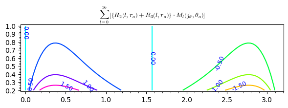
    


```python
contour_plot(sum_phi
        , (theta_a,0,pi), (r_a,0.2,1), fill=False, cmap='hsv', labels=True, 
title = "sum_phi")
```


    
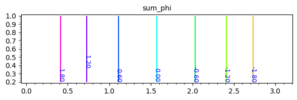
    


sum_phi, sum_cAm
Мы можем найти множитель с помощью которого можно убрать зависимость $A\left(j_r, j_{\theta}, r_a, \theta_a\right)$ от $r_a$


```python
pra = 1/J_r(r_a)/r_a^2
latex_pra=latex(pra)
pra
```


    r_a


```python
sum_cAm_pra = (sum_cAm * pra).full_simplify()
sum_cAm_pra_latex = latex_pra + "\\cdot" + sum_cAm_latex
```

Векторный потенциал электростатического поля точечного заряда в сферической системе координат

$${r_a} A_{\varphi} = - {сtg \, \theta_a}$$


```python
plot([sum_cAm_pra, cot(theta_a)], theta_a, 0.25, pi-0.25).show(
    title="$"+sum_cAm_pra_latex+"$")
```


    
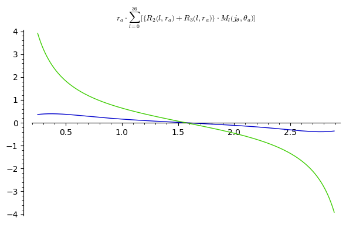
    


# Потенциал взаимодействия магнитных прецессирующих диполей

Рассмотрим задачу взаимодействия двух соосно вокруг оси $z$ прецессирующих магнитных диполей в геометрии задачи, которая изображена в работе https://nbviewer.org/github/daju1/articles/blob/master/electrostatic_vector_potential/Structure_of_electron.ipynb

на втором рисунке.

Запишем выражение для потенциальной функции взаимодействия магнитного тока второй частицы с полем векторного потенциала магнитныого тока первой частицы (Тамм формула 51.10)

$U_{12} = -\frac{1}{c} \int\limits_{V_2} \vec{A_1} \vec{j_2} dV$

Запишем выражение для потенциальной функции взаимодействия магнитного заряда второй частицы с полем скалярного потенциала магнитныого заряда первой частицы (Тамм формула 15.6)

$W_{12} = \int\limits_{V_2} {\phi_1} {\rho_2} dV$

Силу взаимодействия двух прецессирующих диполей можно найти исходя из

$F = - \frac{\partial}{\partial z} \left(U_{12} + W_{12}\right)$

для осуществления данных вычислений интегрирование удобно производить в цилиндрической системе координат

$U_{12} = -\frac{1}{c} \int\limits_{z_m=-\infty}^{\infty}\,\,\int\limits_{\rho_m=0}^{\infty}\left(\int\limits_{\varphi_m=0}^{2\pi}\vec{A_1} \vec{j_2} {\,\rho_m \, d \varphi_m}\right)d \rho_m \, d z_m$

$W_{12} = \int\limits_{z_m=-\infty}^{\infty}\,\,\int\limits_{\rho_m=0}^{\infty}\left(\int\limits_{\varphi_m=0}^{2\pi}{\phi_1} {\rho_2} {\,\rho_m \, d \varphi_m}\right)d \rho_m \, d z_m$

Поскольку в рассматриваемой геометрии магнитный ток и векторный потенциал имеют ненулевыми только лишь $\varphi$ компоненту, следовательно эти векторы всюду параллельны и скалярное произведение этих векторов выражается как произведение модулей этих векторов $\vec{A_1} \vec{j_2} = {A_1}_{\varphi} {j_2}_{\varphi}$ 

$U_{12} = -\frac{1}{c} \int\limits_{z_m=-\infty}^{\infty}\,\,\int\limits_{\rho_m=0}^{\infty}\left(\int\limits_{\varphi_m=0}^{2\pi}{A_1}_{\varphi} {j_2}_{\varphi} {\,\rho_m \, d \varphi_m}\right)d \rho_m \, d z_m$

Поскольку данная геометрия задачи не зависит от $\varphi$ то интегрирование по этой переменной приводит к появлению множителя $2\pi$

$U_{12} = -\frac{{2\pi}}{c} \int\limits_{z_m=-\infty}^{\infty}\,\,\int\limits_{\rho_m=0}^{\infty}{A_1}_{\varphi} {j_2}_{\varphi} {\,\rho_m \, }d \rho_m \, d z_m$

$W_{12} = {2\pi} \int\limits_{z_m=-\infty}^{\infty}\,\,\int\limits_{\rho_m=0}^{\infty}{\phi_1} {\rho_2} {\,\rho_m \, }d \rho_m \, d z_m$

теперь в выражениях для векторного потенциала и плотности магнитного тока необходимо перейти от сферических координат к цилиндрическим. При этом частица 1 будет оставаться в начале коодинат для того чтобы не смещать достаточно сложное выражение для векторного потенциала вдоль оси $z$. Будем изменять координату $z$ частицы 2 

Исходя из выражения для векторного потенциала в сферических координатах


```python
var("rho, z, z_c")
assume(rho > 0)
```


```python
sum_cAm.variables()
```


    (r_a, theta_a)


```python
sum_phi.variables()
```


    (theta_a,)


```python
exec(preparse("A1_spherical = lambda r_a, theta_a : " +str(sum_cAm) + ""))
```


```python
exec(preparse("phi1_spherical = lambda r_a, theta_a : " +str(sum_phi) + ""))
```
disp(A1_spherical(r_m, theta_m))disp(phi1_spherical(r_m, theta_m))
Переход от цилиндрических к сферическим координатам:

${\displaystyle {\begin{cases}r={\sqrt {\rho ^{2}+z^{2}}},\\\theta =\mathrm {arctg} {\dfrac {\rho }{z}},\\\varphi =\varphi .\end{cases}}}$

составляем функцию векторного потенциала и скалярного магнитного потенциала частицы 1 принимающую цилиндрические координаты и производящую переход к сферическим координатам при вызове лямбда функции A1_spherical

$A1_{cylindrical}(\rho, z) = A1_{spherical}(r_a = \sqrt{\rho^2+z^2},
                 \theta_a = atan\dfrac {\rho }{z})$


```python
A1_cylindrical = lambda rho, z : \
    A1_spherical(r_a = sqrt(rho^2+z^2),
                 theta_a = atan2(rho, z))
```


```python
phi1_cylindrical = lambda rho, z : \
    phi1_spherical(r_a = sqrt(rho^2+z^2),
                 theta_a = atan2(rho, z))
```


```python
z1, z2 = -2, 2
ni = 10
dz = (z2-z1)/ni
levels = [z1,z1+dz..z2]
contour_plot(A1_cylindrical(rho, z),
             (rho, 0, 1), (z, -1, 1),
             contours=levels, cmap="jet", colorbar=True).show()
```


    
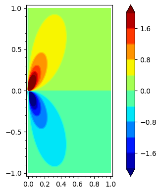
    


```python
contour_plot(phi1_cylindrical(rho, z),
             (rho, 0, 1), (z, -1, 1), cmap="jet", colorbar=True).show()
```


    
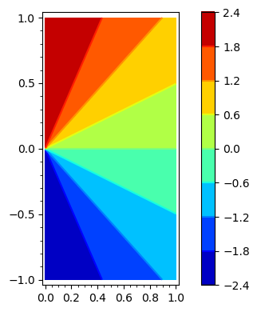
    


И точно так же исходя из выражения для магнитного тока в сферических координатах


```python
J_r(r_m) * J_theta(theta_m)
```


    cos(theta_m)^9/r_m^3


```python
rho_r(r_m) * rho_theta(theta_m)
```


    cos(theta_m)^9/r_m^2


```python
j2_spherical = lambda r_m, theta_m : J_r(r_m) * J_theta(theta_m)
```


```python
rho2_spherical = lambda r_m, theta_m : rho_r(r_m) * rho_theta(theta_m)
```

составляем функцию магнитного тока частицы 2 принимающую цилиндрические координаты и производящую переход к сферическим координатам при вызове лямбда функции j2_spherical, введя в эту функцию третим параметром координату центра частицы 2

$j2_{cylindrical}(\rho, z, z_c) = j2_{spherical}(r_a = \sqrt{\rho^2+(z-z_c)^2},
                 \theta_a = atan\dfrac {\rho }{z - z_c})$


```python
j2_cylindrical = lambda rho, z, z_c : \
    j2_spherical(r_m = sqrt(rho^2+(z-z_c)^2),
                 theta_m = atan2(rho, z-z_c))
```


```python
rho2_cylindrical = lambda rho, z, z_c : \
    rho2_spherical(r_m = sqrt(rho^2+(z-z_c)^2),
                 theta_m = atan2(rho, z-z_c))
```


```python
z1, z2 = -2, 2
ni = 10
dz = (z2-z1)/ni
levels = [z1,z1+dz..z2]
contour_plot(j2_cylindrical(rho, z, z_c=1),
             (rho, 0, 1), (z, -1, 3), contours=levels,
             fill=True, cmap='jet',
             labels=True, colorbar=True).show()
```


    
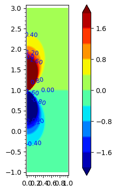
    


```python
z1, z2 = -2, 2
ni = 10
dz = (z2-z1)/ni
levels = [z1,z1+dz..z2]
contour_plot(rho2_cylindrical(rho, z, z_c=1),
             (rho, 0, 1), (z, -1, 3), contours=levels,
             fill=True, cmap='jet',
             labels=True, colorbar=True).show()
```


    
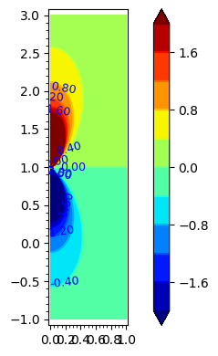
    


```python

disp(j2_cylindrical(rho, z, z_c))
disp(rho2_cylindrical(rho, z, z_c))
```


$\displaystyle \frac{{\left(z - z_{c}\right)}^{9}}{{\left(\rho^{2} + {\left(z - z_{c}\right)}^{2}\right)}^{6}}$


$\displaystyle \frac{{\left(z - z_{c}\right)}^{9}}{{\left(\rho^{2} + {\left(z - z_{c}\right)}^{2}\right)}^{\frac{11}{2}}}$

disp(A1_cylindrical(rho, z))disp(rho1_cylindrical(rho, z))

```python
import numpy as np
def make_A1(zj2, rj2):
    ra_linspace = np.linspace(np.float64(0), np.float64(+100), 20)
    za_linspace = np.linspace(np.float64(-100), np.float64(+300), 40)

    ra_list = ra_linspace.tolist()
    za_list = za_linspace.tolist()

    ra_grid,za_grid = np.meshgrid(ra_linspace, za_linspace)

    a_ = ra_grid * np.nan

    for ix in np.arange(0, len(ra_linspace), 1):
        for iy in np.arange(0, len(za_linspace), 1):

            Rho = ra_list[ix]
            Z   = za_list[iy]

            try:
                A1 = cA_int_zj_rj(rho_a=Rho, z_a=Z,
                                  zj1=-zj2, zj2=zj2,
                                  rj1=0,    rj2=rj2)
                a_[iy][ix] = A1
                # print ("Rho = ", Rho, "Z =", Z, "A1 =", A1)
            except Exception as ex:
                print (ex)
                print ("Rho = ", Rho, "Z =", Z)
                pass

    return ra_grid, za_grid, a_
```

Теперь можем записать подыитегральное выражение в интеграле подынтеграьной функции


```python
U_12_integrand = lambda rho, z, z_c : \
    -2*pi*rho * A1_cylindrical(rho, z) * j2_cylindrical(rho, z, z_c)
```


```python
W_12_integrand = lambda rho, z, z_c : \
    2*pi*rho * phi1_cylindrical(rho, z) * rho2_cylindrical(rho, z, z_c)
```

Теперь можно изобразить поле интегранда графически и заодно численно просуммировать это поле


```python
import numpy as np
def make_U(zc_cur):
    ra_linspace = np.linspace(np.float64(0),    np.float64(+20), 20)
    za_linspace = np.linspace(np.float64(-40), np.float64(+80), 120)
    ra_list = ra_linspace.tolist()
    za_list = za_linspace.tolist()

    ra_grid, za_grid = np.meshgrid(ra_linspace, za_linspace)

    u_ = ra_grid * np.nan
    w_ = ra_grid * np.nan

    sum_u = 0
    sum_w = 0

    for ix in np.arange(0, len(ra_linspace), 1):
        for iy in np.arange(0, len(za_linspace), 1):

            Rho = ra_list[ix]
            Z   = za_list[iy]

            try:
                U = U_12_integrand(rho=Rho, z=Z, z_c=zc_cur).n()
                W = W_12_integrand(rho=Rho, z=Z, z_c=zc_cur).n()
                u_[iy][ix] = U
                w_[iy][ix] = W
                sum_u += U
                sum_w += W
            except Exception as ex:
                print (ex)
                print ("Rho = ", Rho, "Z =", Z, "z_c =", zc_cur)
                pass

    return ra_grid, za_grid, u_, w_, sum_u, sum_w
```


```python
%time (rho_grid, z_grid, u_, w_, sum_u, sum_w) = make_U(zc_cur = 20)
```

    CPU times: user 32.9 s, sys: 14.5 ms, total: 32.9 s
    Wall time: 33 s


```python
from mpl_toolkits import mplot3d
import numpy as np
import matplotlib.pyplot as plt
```


```python
def contour_plot_u(fig, ax, i, rho_grid, z_grid, u, title, levels=None):
    cp = ax[i].contourf(rho_grid, z_grid, u, levels=levels)
    #fig.colorbar(cp) # Add a colorbar to a plot
    ax[i].set_title(title)
    ax[i].set_xlabel('rho')
    if i == 0:
        ax[i].set_ylabel('z')
    ax[i].set_aspect(1)
```


```python
fig_,ax_=plt.subplots(1,2)

levels = np.linspace(-0.0008, 0.0008, 16)
contour_plot_u(fig_, ax_, 0,
               rho_grid, z_grid, u=u_,
               title='Precessing magnets potential',
    levels = None)

levels = np.linspace(-0.08, 0.08, 16)
contour_plot_u(fig_, ax_, 1,
               rho_grid, z_grid, u=w_,
               title='Scalar magnets potential',
    levels = None)
```


    
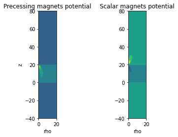
    


```python
def plot_u(rho_grid, z_grid, u, title, levels=None):
    fig,ax=plt.subplots(1,1)
    cp = ax.contourf(rho_grid, z_grid, u, levels=levels)
    fig.colorbar(cp) # Add a colorbar to a plot
    ax.set_title(title)
    ax.set_xlabel('rho')
    ax.set_ylabel('z')
    ax.set_aspect(1)
```


```python
def plot_surf_u(rho_grid, z_grid, u, title):
    ax = plt.axes(projection='3d')
    ax.set_xlabel('z (cm)')
    ax.set_ylabel('r (cm)')
    ax.plot_surface(rho_grid, z_grid, u, cmap='viridis', edgecolor='none')
    ax.set_title(title)
    plt.show()
```


```python
levels = np.linspace(-0.0008, 0.0008, 16)
plot_u(rho_grid, z_grid, u=u_, title='Precessing magnets potential',
    levels = None)
```


    
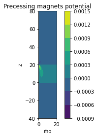
    


```python
plot_surf_u(rho_grid, z_grid, u=u_, title='Precessing magnets potential')
```


    
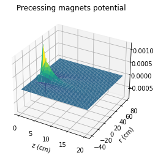
    


```python
levels = np.linspace(-0.08, 0.08, 16)
plot_u(rho_grid, z_grid, u=w_, title='Scalar magnets potential',
    levels = None)
```


    
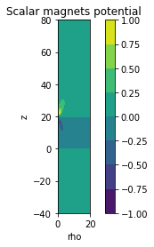
    


```python
plot_surf_u(rho_grid, z_grid, u=w_, title='Scalar magnets potential')
```


    
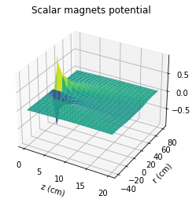
    


А теперь изобразим тоже самое при разных значениях координаты частицы 2


```python
plot_data_sum_U = []
plot_data_sum_Uzc1 = []
plot_data_sum_Uzc2 = []
plot_data_sum_Uzc3 = []

plot_data_sum_W = []
plot_data_sum_Wzc1 = []
plot_data_sum_Wzc2 = []
plot_data_sum_Wzc3 = []

for zc in np.arange(1, 41, 1):
    (rho_grid, z_grid, u_, w_, sum_u, sum_w) = make_U(zc_cur = zc)
    # print (zc, sum_u)
    plot_data_sum_U += [(zc, sum_u)]
    plot_data_sum_Uzc1 += [(zc, sum_u * zc)]
    plot_data_sum_Uzc2 += [(zc, sum_u * zc^2)]
    plot_data_sum_Uzc3 += [(zc, sum_u * zc^3)]

    plot_data_sum_W += [(zc, sum_w)]
    plot_data_sum_Wzc1 += [(zc, sum_w * zc)]
    plot_data_sum_Wzc2 += [(zc, sum_w * zc^2)]
    plot_data_sum_Wzc3 += [(zc, sum_w * zc^3)]

    fig_,ax_= plt.subplots(1,2)

    levels = np.linspace(-0.0008, 0.0008, 16)
    contour_plot_u(fig_, ax_, 0,
                   rho_grid, z_grid, u=u_,
        title="U $z_c$ = {} $\\sum u$ = {:.5e}".format(zc, sum_u),
        levels = None)

    levels = np.linspace(-0.08, 0.08, 16)
    contour_plot_u(fig_, ax_, 1,
                   rho_grid, z_grid, u=w_,
        title="W $z_c$ = {} $\\sum w$ = {:.5e}".format(zc, sum_w),
        levels = None)

    plt.show()
```


    
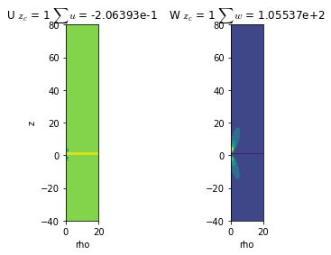
    


    
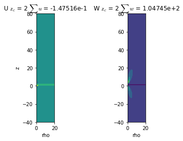
    


    
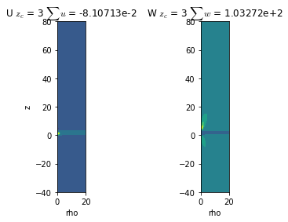
    


    
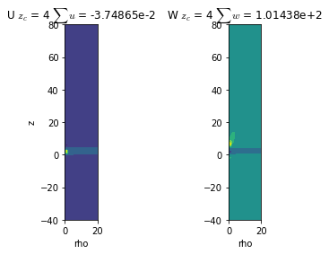
    


    
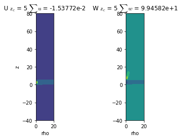
    


    
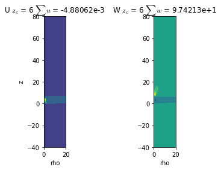
    


    
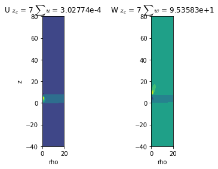
    


    
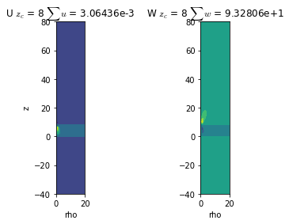
    


    
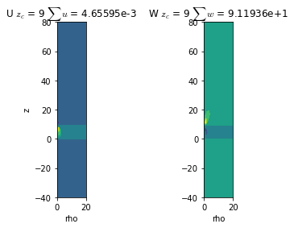
    


    
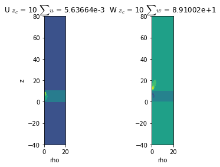
    


    
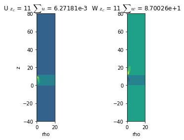
    


    
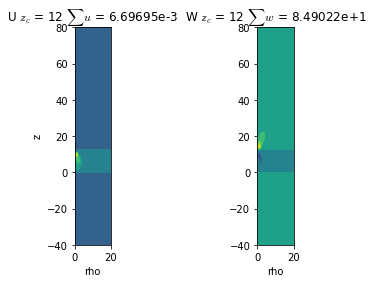
    


    
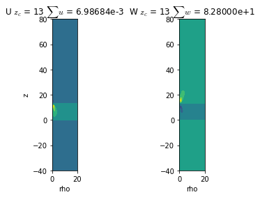
    


    
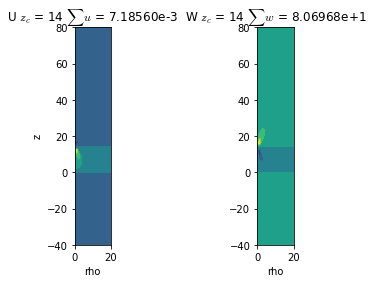
    


    

    


    
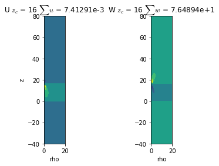
    


    
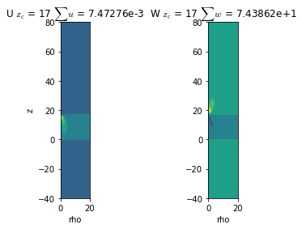
    


    
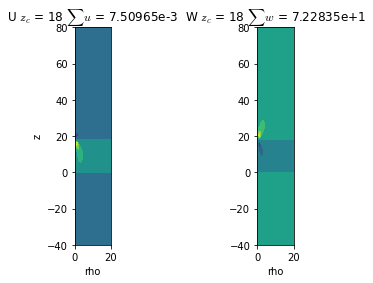
    


    
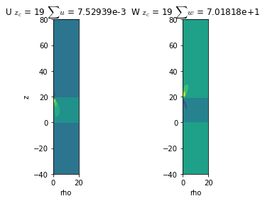
    


    
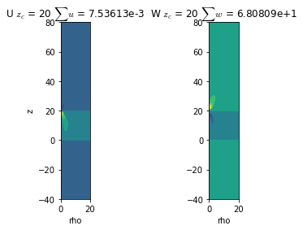
    


    

    


    
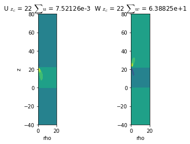
    


    
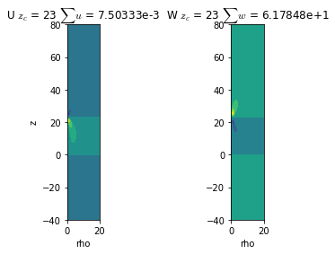
    


    
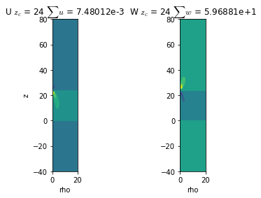
    


    
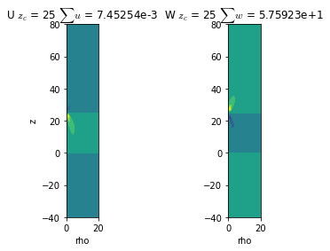
    


    
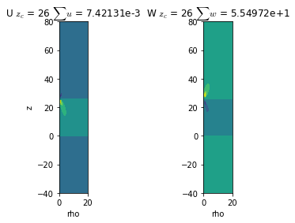
    


    
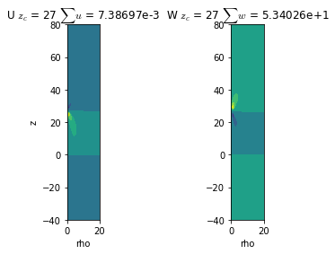
    


    
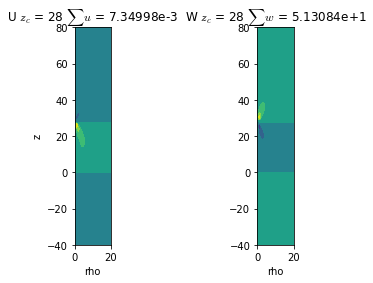
    


    
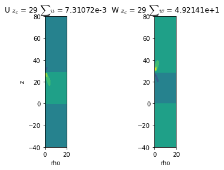
    


    
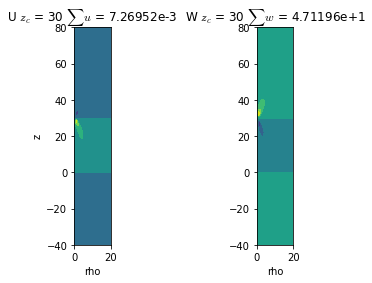
    


    
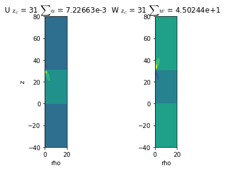
    


    
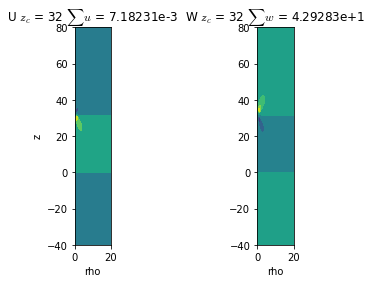
    


    
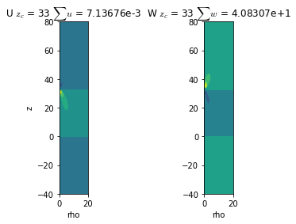
    


    
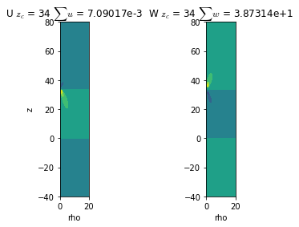
    


    
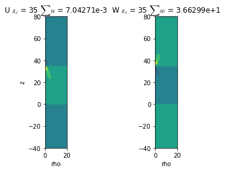
    


    
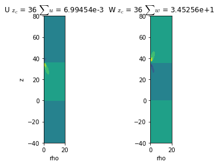
    


    
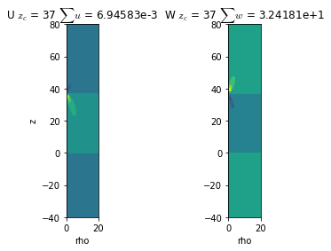
    


    
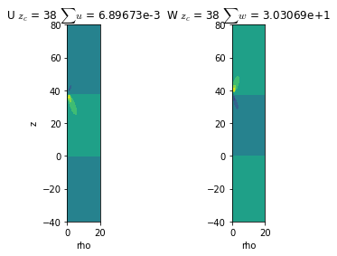
    


    

    


    
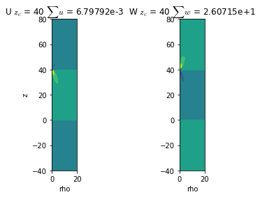
    


```python
p = list_plot(plot_data_sum_U)
p.show(title="Потенциальная функция взаимодействия прецессирующих магнитных диполей",
       axes_labels=["Расстояние между частицами zс", ""])

p = list_plot(plot_data_sum_Uzc1)
p.show(title="z * Потенциальная функция взаимодействия прецессирующих магнитных диполей",
       axes_labels=["Расстояние между частицами zс", ""])

p = list_plot(plot_data_sum_Uzc2)
p.show(title="z^2 * Потенциальная функция взаимодействия прецессирующих магнитных диполей",
       axes_labels=["Расстояние между частицами zс", ""])

p = list_plot(plot_data_sum_Uzc3)
p.show(title="z^3 * Потенциальная функция взаимодействия прецессирующих магнитных диполей",
       axes_labels=["Расстояние между частицами zс", ""])
```


    
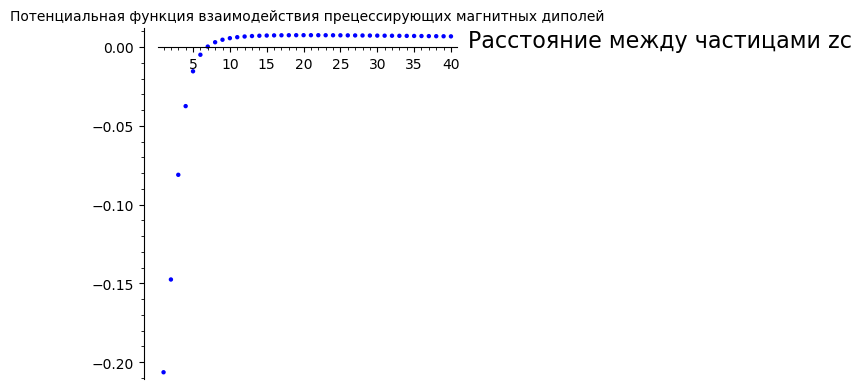
    


    

    


    

    


    

    


```python
p = list_plot(plot_data_sum_W)
p.show(title="Энергия взаимодействия магнитных диполей",
       axes_labels=["Расстояние между частицами zс", ""])

p = list_plot(plot_data_sum_Wzc1)
p.show(title="z * Энергия взаимодействия магнитных диполей",
       axes_labels=["Расстояние между частицами zс", ""])

p = list_plot(plot_data_sum_Wzc2)
p.show(title="z^2 * Энергия взаимодействия магнитных диполей",
       axes_labels=["Расстояние между частицами zс", ""])

p = list_plot(plot_data_sum_Wzc3)
p.show(title="z^3 * Энергия взаимодействия магнитных диполей",
       axes_labels=["Расстояние между частицами zс", ""])
```


    

    


    

    


    

    


    

    


Таким образом на данных графиках просматривается важный вывод: Потенциальная функция взаимодействия прецессирующих магнитных диполей убывает по закону $\frac{1}{z}$ что соответствует классическому кулоновскому взаимодействию электрических зарядов. Только в данной модели "электрический заряд" становится кажущимся эффективным фантомом, который является лишь следствием проявления магнитной силы Ампера между движущимися магнитными зарядами образующими магнитные токи.

А поскольку магнитный заряд это положительная или отрицательная дислокация эфирной среды, поэтому взаимодействие между движущимися магнитными зарядами (дислокациями) происходит вследствие того что движущаяся дислокация производит возбуждение фонона в эфирной среде, которые достигая другого движущегося магнитного заряда (дислокации)  воздействуют на него силой аналогичной силе Пича-Келлера

Производим численное интегрирование


```python
from scipy import integrate as scipy_integrate
```


```python
U_int_z = lambda z_c, rho, z1, z2: \
    scipy_integrate.quad(lambda z : U_12_integrand(rho, z, z_c), z1, z2)[0]
```


```python
W_int_z = lambda z_c, rho, z1, z2: \
    scipy_integrate.quad(lambda z : W_12_integrand(rho, z, z_c), z1, z2)[0]
```


```python
U_int_z_int_rho = lambda z_c, z1, z2, rho1, rho2: \
    scipy_integrate.quad(lambda rho : U_int_z(z_c, rho, z1, z2), rho1, rho2)[0]
```


```python
W_int_z_int_rho = lambda z_c, z1, z2, rho1, rho2: \
    scipy_integrate.quad(lambda rho : W_int_z(z_c, rho, z1, z2), rho1, rho2)[0]
```

Здесь для быстроты получения предварительного результата производим интегрирование только лишь по $z$ координате зафиксировав с помощью параметра $\rho = const$ некий цилиндр интегрирования
def plot_U_int_z(rho):
    import numpy as np
    plot_data_U_int_z = []
    plot_data_Uzc_int_z = []
    plot_data_Uzc2_int_z = []
    plot_data_Uzc3_int_z = []
    plot_data_Uzc4_int_z = []
    plot_data_Uzc5_int_z = []
    plot_data_Uzc6_int_z = []
    for zc in np.arange(20, 200, 5):
        U = U_int_z(z_c = zc, rho = rho, z1 = -1000, z2 = 1000)
        print("zc", zc, U)
        plot_data_U_int_z += [(zc, U)]
        plot_data_Uzc_int_z += [(zc, U * zc)]
        plot_data_Uzc2_int_z += [(zc, U * zc^2)]
        plot_data_Uzc3_int_z += [(zc, U * zc^3)]
        plot_data_Uzc4_int_z += [(zc, U * zc^4)]
        plot_data_Uzc5_int_z += [(zc, U * zc^5)]
        plot_data_Uzc6_int_z += [(zc, U * zc^6)]
        
    p = list_plot(plot_data_U_int_z)
    p.show(title="Потенциальная функция взаимодействия прецессирующих магнитных диполей rho = "+str(rho),
           axes_labels=["Расстояние между частицами zс", ""])
    
    p = list_plot(plot_data_Uzc2_int_z)
    p.show(title="z^2 Потенциальная функция взаимодействия прецессирующих магнитных диполей rho = "+str(rho),
           axes_labels=["Расстояние между частицами zс", ""])
    
    p = list_plot(plot_data_Uzc3_int_z)
    p.show(title="z^3 Потенциальная функция взаимодействия прецессирующих магнитных диполей rho = "+str(rho),
           axes_labels=["Расстояние между частицами zс", ""])
    
    p = list_plot(plot_data_Uzc4_int_z)
    p.show(title="z^4 Потенциальная функция взаимодействия прецессирующих магнитных диполей rho = "+str(rho),
           axes_labels=["Расстояние между частицами zс", ""])
Графически можно увидеть, что потенциальная функция проинтегрированная лишь в цилиндрическом сечении даёт потенциальную функцию убывающую в третьем порядке от расстояния между центрами частиц
for rho in [1,2,3,4,5]:
    plot_U_int_z(rho)

```python
import numpy as np
plot_data_U_int_z_int_rho = []
plot_data_Uzc1_int_z_int_rho = []
plot_data_Uzc2_int_z_int_rho = []
plot_data_Uzc3_int_z_int_rho = []
plot_data_Uzc4_int_z_int_rho = []
plot_data_Uzc5_int_z_int_rho = []
plot_data_Uzc6_int_z_int_rho = []
for zc in np.arange(5, 41, 1):
    U = U_int_z_int_rho(z_c = zc,
                        z1 = -40, z2 = +80,
                        rho1 = 0, rho2 = 20)
    print("zc", zc, U)
    plot_data_U_int_z_int_rho += [(zc, U)]
    plot_data_Uzc1_int_z_int_rho += [(zc, U * zc)]
    plot_data_Uzc2_int_z_int_rho += [(zc, U * zc^2)]
    plot_data_Uzc3_int_z_int_rho += [(zc, U * zc^3)]
    plot_data_Uzc4_int_z_int_rho += [(zc, U * zc^4)]
    plot_data_Uzc5_int_z_int_rho += [(zc, U * zc^5)]
    plot_data_Uzc6_int_z_int_rho += [(zc, U * zc^6)]
```

    zc 5 0.0091231176520583
    zc 6 0.009077372867291445


    /tmp/ipykernel_10284/2606896900.py:1: IntegrationWarning: The integral is probably divergent, or slowly convergent.
      U_int_z = lambda z_c, rho, z1, z2:     scipy_integrate.quad(lambda z : U_12_integrand(rho, z, z_c), z1, z2)[Integer(0)]


    zc 7 0.009031821694133179
    zc 8 0.008986604526163785
    zc 9 0.008941365467141298
    zc 10 0.008896104027471503
    zc 11 0.008850726995046495


    /tmp/ipykernel_10284/2606896900.py:1: IntegrationWarning: The algorithm does not converge.  Roundoff error is detected
      in the extrapolation table.  It is assumed that the requested tolerance
      cannot be achieved, and that the returned result (if full_output = 1) is 
      the best which can be obtained.
      U_int_z = lambda z_c, rho, z1, z2:     scipy_integrate.quad(lambda z : U_12_integrand(rho, z, z_c), z1, z2)[Integer(0)]


plot_data_U_int_z_int_rho


```python
p = list_plot(plot_data_U_int_z_int_rho)
p.show(title="Потенциальная функция взаимодействия прецессирующих магнитных диполей",
       axes_labels=["Расстояние между частицами zс", ""])
```


    

    


```python
p = list_plot(plot_data_Uzc1_int_z_int_rho)
p.show(title="Потенциальная функция взаимодействия прецессирующих магнитных диполей",
       axes_labels=["Расстояние между частицами zс", ""])
```


    

    


```python
p = list_plot(plot_data_Uzc2_int_z_int_rho)
p.show(title="Потенциальная функция взаимодействия прецессирующих магнитных диполей",
       axes_labels=["Расстояние между частицами zс", ""])
```


    

    


```python
p = list_plot(plot_data_Uzc3_int_z_int_rho)
p.show(title="Потенциальная функция взаимодействия прецессирующих магнитных диполей",
       axes_labels=["Расстояние между частицами zс", ""])
```


    

    


```python

```
