# Classical electron model

is an electrically charged sphere which is rotated

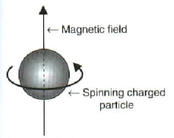

and as result electron have magnetic moment

but we have the following problem:

To explaine real value of magnetic moment the speed of rotating of classical electron should be more than speed of velocity

So I see that "weight" of magnetic nature is more significant for real electron than "weight" of electric nature

# What is Columb electrostatic field

$$\vec{E} = \frac{q}{r^2}\frac{\vec{r}}{r} = \frac{q}{r^3}\vec{r}$$

Does it have vector potential?

$$rot\vec{A_E} = \vec{E}$$

Yes we have

$$\vec A_E = -\frac{ctg \, \theta}{r}\,{\vec {e}}_{\varphi }$$

And here we see that vector potential of electric charge has some axis of rotated magnetic charges rotating

$${{A^{*}}_E}_{\varphi} = \frac{1}{c}\int\limits_{V}^{}\frac{{j_m}_{\varphi}}{R} dV$$

where

$${{j_m}_{\varphi}}  = {{\rho_m}} \cdot {{\omega_m}} \sim \frac{cos(\theta_m)^{2k+1}}{r^{3}} $$

is density of magnetic current

$${{\rho_m}} \sim \frac{cos(\theta_m)^{2k+1}}{r^{2}} $$

is density of magnetic charge and

$${{\omega_m}} \sim \frac{1}{r} $$

is angular frequency of magnetic charge

# How it looks like?


```python
n = 4
Rd = n
sd = 6
rc = 0.35

color = "green"

def draw_scheme(phi_up, phi_dw, x, y, spin_up, north_up):
    p = Graphics()

    # centers of circles
    cup = (x, y + sd/2+Rd/n)
    cdw =  (x, y - sd/2-Rd/n)
    
    if spin_up:
        dphid = pi/6
        p += arrow (cdw, cup, color = color, arrowsize=3)
    else:
        dphid = -pi/6
        phi_up += pi/6
        phi_dw -= pi/6
        p += arrow (cup, cdw, color = color, arrowsize=3)
    
    if north_up:
        color_up = "blue"
        color_dw = "red"
    else:
        color_up = "red"
        color_dw = "blue"
    
    
    p += ellipse(cup, Rd, Rd/n, linestyle="dashed", color = color_up)
    p += ellipse(cdw, Rd, Rd/n, linestyle="dashed", color=color_dw)
    
    # current positions of rotated masses
    pup_cur = (cup[0] + Rd*cos(phi_up), cup[1] + Rd*sin(phi_up)/n)
    pdw_cur = (cdw[0] - Rd*cos(phi_dw), cdw[1] + Rd*sin(phi_dw)/n)
    
    # distance between current positions
    p += line ([pdw_cur, pup_cur], color = color, linestyle="dashed")
    p += circle(pdw_cur, rc, color = color_dw)
    p += circle(pup_cur, rc, color = color_up)
 
    # draw arrow

    for i in [0,1,2,3]:
        _phi_up = phi_up + i*pi/2
        _phi_dw = phi_dw + i*pi/2
        pr_cur_arr = (cup[0] + Rd*cos(_phi_up), cup[1] + Rd*sin(_phi_up)/n)
        pl_cur_arr = (cdw[0] - Rd*cos(_phi_dw), cdw[1] + Rd*sin(_phi_dw)/n)

        pr_pre_arr = (cup[0] + Rd*cos(_phi_up+dphid), cup[1] + Rd*sin(_phi_up+dphid)/n)
        pl_pre_arr = (cdw[0] - Rd*cos(_phi_dw-dphid), cdw[1] + Rd*sin(_phi_dw-dphid)/n)

        p += arrow (pr_cur_arr, pr_pre_arr, color = color_up, arrowsize=3)
        p += arrow (pl_cur_arr, pl_pre_arr, color = color_dw, arrowsize=3)

    
    return p
```


```python
p = draw_scheme(pi/6+0, -pi/6-pi*2, 0, 11, spin_up=True, north_up=True)
p.show(aspect_ratio = 1, axes=False,
       title="Electron's structure is just precessing magnetic dipole.\n"
       "Rotation prevents annihilation of magnetic charges")
```


    
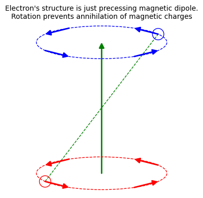
    


```python
p =draw_scheme(pi/6+0, -pi/6-pi*2, 0, 11, spin_up=True, north_up=True)
p+=draw_scheme(pi/6+0, -pi/6-pi*2, 0, 0, spin_up=True, north_up=True)
p.show(aspect_ratio = 1, axes=False,
       title="Two electrons with collinear spins:\n"
       "repulsion due to Ampere force of antidirectional magnetic currents")
```


    
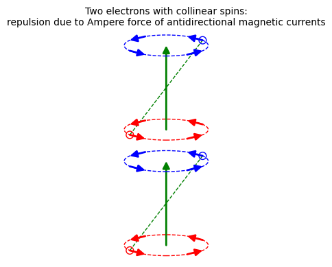
    


```python
p =draw_scheme(pi/6+0, -pi/6-pi*2, 0, 0, spin_up=True, north_up=True)
p+=draw_scheme(pi/6+0, -pi/6-pi*2, 9, 0, spin_up=True, north_up=True)
p.show(aspect_ratio = 1, axes=False,
       title="Two electrons with collinear spins:\n"
       "repulsion due to Ampere force of antidirectional magnetic currents")
```


    
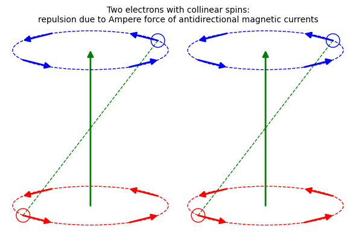
    


```python
p =draw_scheme(pi/6+0, -pi/6-pi*2, 0, 11, spin_up=True, north_up=True)
p+=draw_scheme(pi/6+0, -pi/6-pi*2, 0, 0, spin_up=False, north_up=False)
p.show(aspect_ratio = 1, axes=False,
       title="Two electrons with anticollinear spins:\n"
       "repulsion due to Ampere force of antidirectional magnetic currents")
```


    
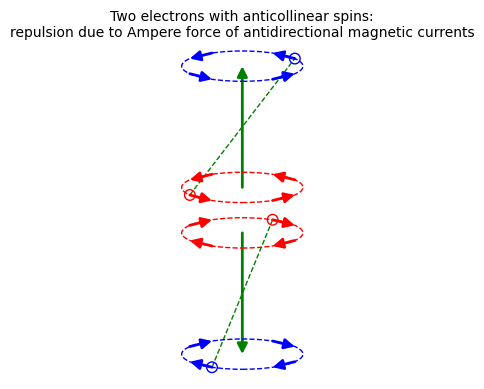
    


```python
p =draw_scheme(pi/6+0, -pi/6-pi*2, 0, 0, spin_up=True, north_up=True)
p+=draw_scheme(pi/6+0, -pi/6-pi*2, 9, 0, spin_up=False, north_up=False)
p.show(aspect_ratio = 1, axes=False,
       title="Two electrons with anticollinear spins:\n"
       "repulsion due to Ampere force of antidirectional magnetic currents")
```


    
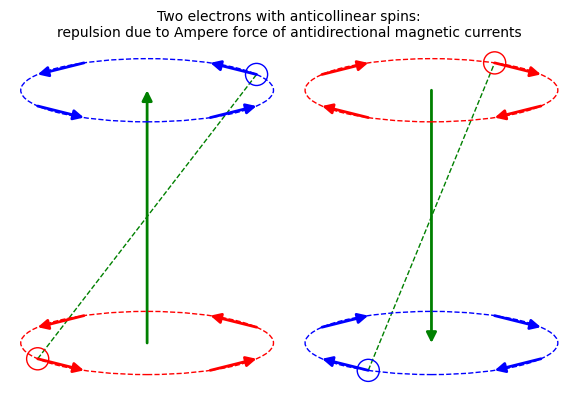
    


```python
p =draw_scheme(pi/6+0, -pi/6-pi*2, 0, 11, spin_up=True, north_up=True)
p+=draw_scheme(pi/6+0, -pi/6-pi*2, 0, 0, spin_up=True, north_up=False)
p.show(aspect_ratio = 1, axes=False,
       title="Electron and positron with collinear spins:\n"
       "attraction due to Ampere force of co-directed magnetic currents.\n"
       "Seems like no annihilation in this state")
```


    
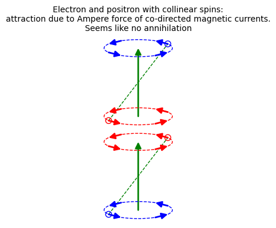
    


```python
p =draw_scheme(pi/6+0, -pi/6-pi*2, 0, 0, spin_up=True, north_up=True)
p+=draw_scheme(pi/6+0, -pi/6-pi*2, 9, 0, spin_up=True, north_up=False)
p.show(aspect_ratio = 1, axes=False,
       title="Electron and positron with collinear spins:\n"
       "attraction due to Ampere force of co-directed magnetic currents.\n"
       "Seems like annihilation is possible in this state\n")
```


    
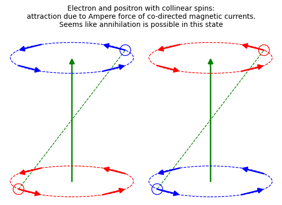
    


```python
p =draw_scheme(pi/6+0, -pi/6-pi*2, 0, 0, spin_up=True, north_up=True)
p+=draw_scheme(pi/6+0, -pi/6-pi*2, 2, 0, spin_up=True, north_up=False)
p.show(aspect_ratio = 1, axes=False,
       title="Electron and positron with collinear spins:\n"
       "attraction due to Ampere force of co-directed magnetic currents.\n"
       "Annihilation looks like this:\n")
```


    
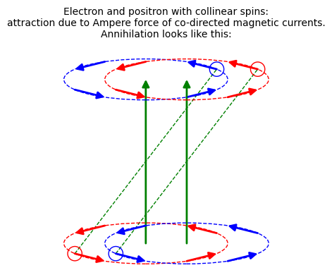
    


```python
p =draw_scheme(pi/6+0, -pi/6-pi*2, 0, 11, spin_up=True, north_up=True)
p+=draw_scheme(pi/6+0, -pi/6-pi*2, 0, 0, spin_up=False, north_up=True)
p.show(aspect_ratio = 1, axes=False,
       title="Electron and positron with anticollinear spins:\n"
       "attraction due to Ampere force of co-directed magnetic currents.\n"
       "Leads to annihilation")
```


    
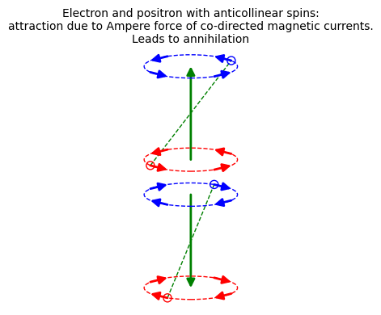
    


```python
p =draw_scheme(pi/6+0, -pi/6-pi*2, 0, 8, spin_up=True, north_up=True)
p+=draw_scheme(pi/6+0, -pi/6-pi*2, 0, 0, spin_up=False, north_up=True)
p.show(aspect_ratio = 1, axes=False,
       title="Electron and positron with anticollinear spins: annihilation")
```


    
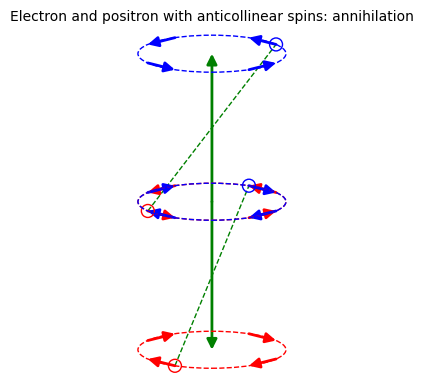
    


```python

```


```python
p =draw_scheme(pi/6+0, -pi/6-pi*2, 0, 0, spin_up=True, north_up=True)
p+=draw_scheme(pi/6+0, -pi/6-pi*2, 9, 0, spin_up=False, north_up=True)
p.show(aspect_ratio = 1, axes=False,
       title="Electron and positron with anticollinear spins:\n"
       "attraction due to Ampere force of co-directed magnetic currents.\n"
       "Seems like no annihilation in this state")
```


    
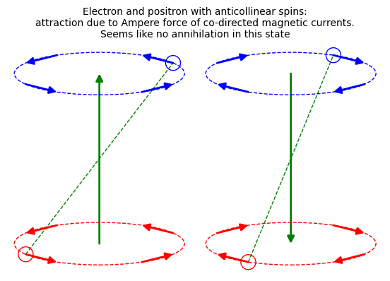
    


```python

```
